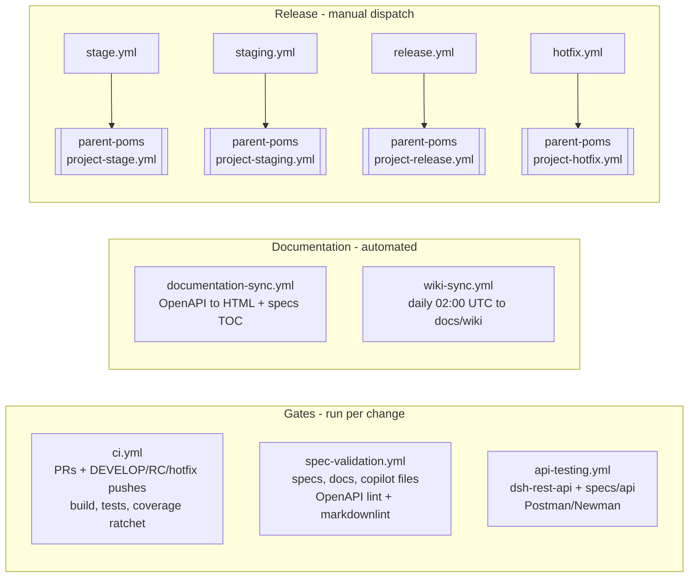

# DevOps: Branching, CI/CD and Release Pipeline

This document describes how code moves from a feature branch to a tagged release in the `dsh`
repository: the branching model, the GitHub Actions workflows that gate and automate that
movement, and the parent POM dependency that every build resolves against.

## Branching and Release Model

- Feature work branches off `DEVELOP` (e.g. `issue-91-extract-repo`) and merges back into
  `DEVELOP` once a PR passes CI.
- `DEVELOP` is periodically staged into a release-candidate branch named
  `staging-<version>-SNAPSHOT-RC` (e.g. `staging-0.3.0-SNAPSHOT-RC`), which is stabilised and
  eventually merged into `master` with a version tag (e.g. `v0.3.0`).
- Each release on `master` also opens a hotfix line branch named `<version>.x` (e.g. `0.3.x`) for
  patches against that release without pulling in unreleased `DEVELOP` work.
- The four release transitions above (stage, staging stabilisation, release-to-master, hotfix) are
  each driven by a manually dispatched workflow — see the Pipeline Map below.

## Pipeline Map

This diagram was checked node-for-node against the live YAML in `.github/workflows/` (see the
table below) and matches it; no trigger shown here is invented.

## Workflow Reference

| Workflow | Trigger(s) | What it gates / does |
| --- | --- | --- |
| `ci.yml` | `pull_request` (any branch); `push` to `DEVELOP`, `staging-*-RC`, `*.x`; `workflow_dispatch` | Builds and tests all modules (`mvn install`, no `-U`), then runs the coverage ratchet (`scripts/check-coverage.sh` against `.github/coverage-baseline.txt`). This is the primary correctness gate. |
| `spec-validation.yml` | `push` and `pull_request`, both scoped to paths `specs/**`, `docs/wiki/**`, `.github/copilot-instructions.md`, `.github/copilot/**`, `.github/roles.md` | Lints the OpenAPI spec with Redocly, lints Markdown under `specs/`, `.github/` and `docs/` (excluding `docs/wiki/**`) with markdownlint, and checks that files referenced from `copilot-instructions.md` exist. |
| `api-testing.yml` | `push` to `DEVELOP`/`main` and `pull_request`, both scoped to paths `dsh-rest-api/**`, `specs/api/**`; `workflow_dispatch` | Builds the full project, boots `dsh-rest-api` against MongoDB/RabbitMQ service containers, and runs the Postman collections in `specs/api/postman/` via Newman. |
| `documentation-sync.yml` | `push` to `DEVELOP`/`main`, scoped to paths `specs/api/openapi/**`, `specs/architecture/**`, `specs/features/**`, `docs/wiki/**`; `workflow_dispatch` | Two jobs: regenerates HTML API docs from the OpenAPI spec into `docs/api/`, and refreshes the table of contents in `specs/features/*.md` and `specs/architecture/*.md`. Both auto-commit with `[skip ci]`. |
| `wiki-sync.yml` | `schedule` (`0 2 * * *`, daily 02:00 UTC); `workflow_dispatch` | Because the cron fires on the default branch (`master`), a `redispatch` job re-triggers the workflow on `DEVELOP` when it isn't already running there; the `sync-wiki` job then copies the GitHub wiki's Markdown pages into `docs/wiki/` via a pull request. |
| `stage.yml` | `workflow_dispatch` only | Delegates to the reusable `project-stage.yml` workflow in `MRISS-Projects/parent-poms` to cut a `staging-<version>-SNAPSHOT-RC` branch from `DEVELOP`. |
| `staging.yml` | `workflow_dispatch` only | Delegates to `project-staging.yml` in `parent-poms` to stabilise/build an existing RC branch. |
| `release.yml` | `workflow_dispatch` only | Delegates to `project-release.yml` in `parent-poms` to promote an RC branch to a tagged release on `master` and open the next hotfix line. |
| `hotfix.yml` | `workflow_dispatch` only | Delegates to `project-hotfix.yml` in `parent-poms` to build/release a patch from an existing `<version>.x` hotfix branch. |

All four release workflows (`stage.yml`, `staging.yml`, `release.yml`, `hotfix.yml`) are thin
wrappers: they take `workflow_dispatch` inputs and pass them straight through to a reusable
workflow hosted in the separate `MRISS-Projects/parent-poms` repository, which does the actual
Maven release work. They are only ever started by a person from the Actions tab, never by a push
or PR.

`.travis.yml` and the `build-ci*.sh` scripts (`build-ci.sh`, `build-ci-stage.sh`,
`build-ci-staging.sh`, `build-ci-release.sh`) still exist in the repository root and still
reference Travis-specific variables (`TRAVIS_BRANCH`, `TRAVIS_PULL_REQUEST`). They are leftovers
from before the move to GitHub Actions. The active gates are the GitHub Actions workflows in the
table above; the Travis configuration is not part of the working pipeline and should not be relied
on.

## Parent POM

Every module in this repository inherits from `com.mriss.mriss-parent:products`, resolved from
the `MRISS-Projects/maven-repo` GitHub Packages registry (see the `<parent>` block in the root
`pom.xml`). CI (`ci.yml`) configures a Maven `settings.xml` with credentials for that registry and
builds with plain `mvn install`, deliberately without `-U`, because the parent is currently pinned
to a `SNAPSHOT` version. Parent version upgrades are a deliberate, manual step, not something a
workflow does automatically.

The repository also contains `install-parent-pom.sh`, which installs `com.mriss:mriss-parent:1.2.4`
from the local `parent-pom.xml`. That is a separate, legacy artifact: no module in this repository
inherits from it, and `ci.yml` does not call this script. It is not part of the working build
pipeline described above.

The current pin to `com.mriss.mriss-parent:products:3.8.0-SNAPSHOT` carries a known reproducibility
cost: Maven refreshes `SNAPSHOT` metadata daily, so the same commit in this repository can resolve
a different parent POM — and therefore build differently — on different days depending on when it
is built relative to that refresh.

**This is an accepted decision, not an oversight — do not "fix" it.** Upcoming work on the
`MRISS-Projects/parent-poms` project will change this repository, and tracking a `SNAPSHOT` is how
those changes reach it without cutting a parent release per iteration. `ci.yml` omitting `-U` is
the deliberate mitigation: it limits drift to Maven's daily refresh rather than forcing a
re-resolve on every run. Pinning a released parent version is worth revisiting only once the
`parent-poms` work has settled.
