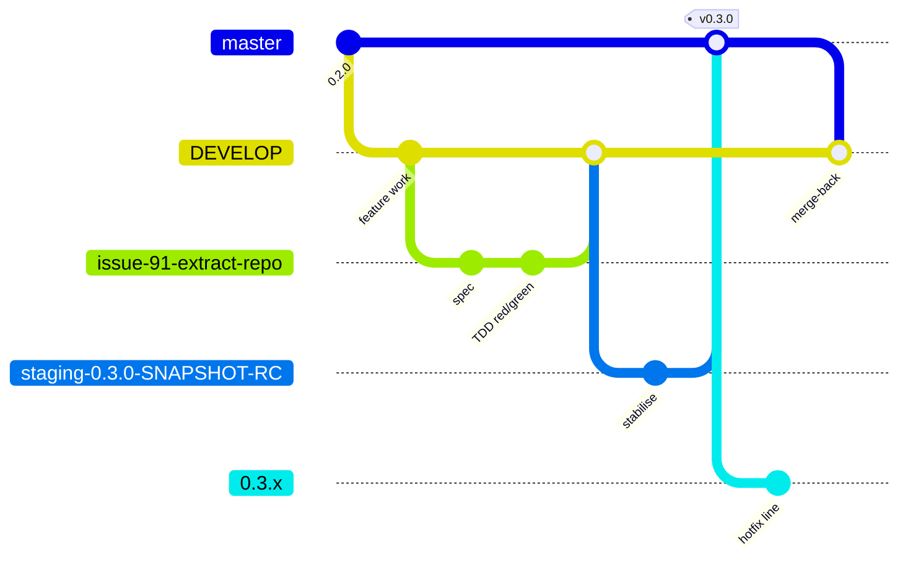
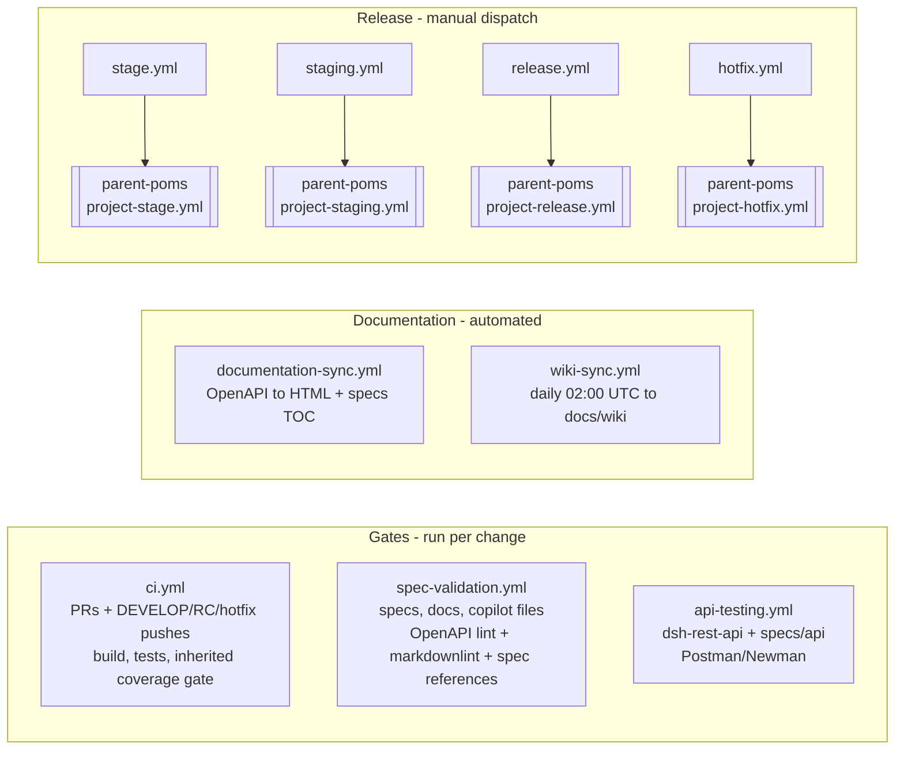

# DevOps: Branching, CI/CD and Release Pipeline

This document describes how code moves from a feature branch to a tagged release in the `dsh`
repository: the branching model, the GitHub Actions workflows that gate and automate that
movement, and the parent POM dependency that every build resolves against.

## Branching and Release Model



- Feature work branches off `DEVELOP` (e.g. `issue-91-extract-repo`) and merges back into
  `DEVELOP` once a PR passes CI.
- `DEVELOP` is periodically staged into a release-candidate branch named
  `staging-<version>-SNAPSHOT-RC` (e.g. `staging-0.3.0-SNAPSHOT-RC`), which is stabilised and
  eventually merged into `master` with a version tag (e.g. `v0.3.0`).
- Each release on `master` also opens a hotfix line branch named `<version>.x` (e.g. `0.3.x`) for
  patches against that release without pulling in unreleased `DEVELOP` work.
- Every release and hotfix release ends by merging its tag back into `DEVELOP`, so the release's
  fixes are never lost to the next line. The tag is first aligned to `DEVELOP`'s version, so
  `DEVELOP` keeps its own version through the merge. A conflict stops the run with nothing pushed:
  the release itself is complete, and a person finishes the merge from the tag.
- The four release transitions above (stage, staging stabilisation, release-to-master, hotfix) are
  each driven by a manually dispatched workflow — see the Pipeline Map below.

## Pipeline Map



This diagram was checked node-for-node against the live YAML in `.github/workflows/` (see the
table below) and matches it; no trigger shown here is invented.

## Workflow Reference

| Workflow | Trigger(s) | What it gates / does |
| --- | --- | --- |
| `ci.yml` | `pull_request` (any branch); `push` to `DEVELOP`, `staging-*-RC`, `*.x`; `workflow_dispatch` | Builds and tests all modules (`mvn -B -U install`). That single command *is* the coverage gate: `jacoco:check` enforces a 95% LINE and BRANCH minimum per module, and `enforce-coverage-data-exists` fails a module that produced no coverage data at all. Both are bound to `verify` and inherited from `parent-poms` rather than declared here. This is the primary correctness gate. |
| `spec-validation.yml` | `push` and `pull_request`, both scoped to paths `specs/**`, `docs/**`, `.github/copilot-instructions.md`, `.github/copilot/**`, `.github/roles.md`, `.github/scripts/**`, `.github/skills/**`, `.github/workflows/spec-validation.yml`, `.markdownlint.json`, `CLAUDE.md`, `.claude/**` | Lints the OpenAPI spec with Redocly, lints Markdown under `specs/`, `.github/`, `docs/` (excluding `docs/wiki/**`), `CLAUDE.md` and `.claude/` with markdownlint, and verifies that every path referenced from `copilot-instructions.md` resolves. That last check is enforcing: it fails the job on an unresolved reference, on a source file it cannot read, and when it extracts no references at all. Its logic is covered by `.github/scripts/check-spec-references.test.sh`, which the same job runs first. |
| `api-testing.yml` | `push` to `DEVELOP`/`main` and `pull_request`, both scoped to paths `dsh-rest-api/**`, `specs/api/**`; `workflow_dispatch` | Builds the full project, boots `dsh-rest-api` against MongoDB/RabbitMQ service containers, and runs the Postman collections in `specs/api/postman/` via Newman. |
| `documentation-sync.yml` | `push` to `DEVELOP`/`main`, scoped to paths `specs/api/openapi/**`, `specs/architecture/**`, `specs/features/**`, `docs/wiki/**`; `workflow_dispatch` | Two jobs: regenerates HTML API docs from the OpenAPI spec into `docs/api/`, and refreshes the table of contents in `specs/features/*.md` and `specs/architecture/*.md`. Both auto-commit with `[skip ci]`. |
| `wiki-sync.yml` | `schedule` (`0 2 * * *`, daily 02:00 UTC); `workflow_dispatch` | Because the cron fires on the default branch (`master`), a `redispatch` job re-triggers the workflow on `DEVELOP` when it isn't already running there; the `sync-wiki` job then copies the GitHub wiki's Markdown pages into `docs/wiki/` via a pull request. |
| `stage.yml` | `workflow_dispatch` only | Delegates to the reusable `project-stage.yml` workflow in `MRISS-Projects/parent-poms` to cut a `staging-<version>-SNAPSHOT-RC` branch from `DEVELOP`. |
| `staging.yml` | `workflow_dispatch` only | Delegates to `project-staging.yml` in `parent-poms` to stabilise/build an existing RC branch. Passes this repository's build properties as `maven_properties`, plus three `mongo_*` inputs the upstream Mongo setup step still needs — see below. |
| `release.yml` | `workflow_dispatch` only | Delegates to `project-release.yml` in `parent-poms` to promote an RC branch to a tagged release on `master` and open the next hotfix line, then merge the release tag back into `DEVELOP`. Takes a `dry_run` checkbox, and passes `maven_properties` and `development_branch: DEVELOP`. |
| `hotfix.yml` | `workflow_dispatch` only | Delegates to `project-hotfix.yml` in `parent-poms` to build/release a patch from an existing `<version>.x` hotfix branch. Ends by merging the release tag back into `DEVELOP`. Takes the same `dry_run` checkbox, `maven_properties` and `development_branch: DEVELOP`. |

All four release workflows (`stage.yml`, `staging.yml`, `release.yml`, `hotfix.yml`) are thin
wrappers: they take `workflow_dispatch` inputs and pass them straight through to a reusable
workflow hosted in the separate `MRISS-Projects/parent-poms` repository, which does the actual
Maven release work. They are only ever started by a person from the Actions tab, never by a push
or PR.

### Rehearsing a release

`release.yml` and `hotfix.yml` carry a **Rehearse** checkbox (`dry_run`). Tick it and the run does
everything a real release does — `release:prepare`, `release:perform`, the version arithmetic, the
site build — while writing nothing anyone else can see. Specifically, a rehearsal performs **no
artifact deploy, no `gh-pages` publication, no push to `master`, no push to `DEVELOP`, and no
deletion of the RC branch**. Every suppressed write announces itself in the log, and the run ends by
proving against the live remote that it changed nothing.

The merge back into `DEVELOP` is still computed and checked, only not pushed. Its log line
`merge-to-develop: carried <n> path(s) from <tag> into DEVELOP; 0 lost` is the one worth reading
before a first release: it says how much release-line work the merge brings home, and that the merge
was a plain one, with no file settled by picking a side.

**Run one before the first release on any line** — before `0.3.0`, and before the first `0.3.x`
hotfix. A release touches `master`, tags, the hotfix branch and the package registry in one
irreversible sequence; a rehearsal is the only way to read what it will do beforehand. Leave the
box unticked and the run is a real release, exactly as it was before the checkbox existed.

The rehearsal itself lives upstream in `parent-poms` (`#72`); these wrappers only make it
reachable from this repository's Actions tab (`#111`).

### How build properties reach a release build

`dsh-data/src/main/resources/mongo.properties` is filtered by `maven-resources-plugin` and carries
four placeholders — `mongo.host`, `mongo.port`, `mongo.user`, `mongo.password`. If a build does not
define them, filtering leaves `${mongo.port}` as literal text and every `dsh-rest-api` Spring
context fails with `Circular placeholder reference 'mongo.port' in property definitions`. That is a
property-resolution failure, not a connectivity one: it happens whether or not a MongoDB is
running.

Each build path supplies them its own way:

| Path | Where the values come from | Live MongoDB? |
| --- | --- | --- |
| Local `mvn install` | **your own `~/.m2/settings.xml`** — see below | yours, if you run one |
| `ci.yml` | the `github-packages` profile of the `settings.xml` it writes | yes, service container |
| `staging.yml` | `maven_properties`, rendered upstream into the generated `settings.xml` | yes, service container |
| `release.yml`, `hotfix.yml` | the same `maven_properties` block | no — nothing connects on this path |

Precedence is **command line > active settings profile > POM `<properties>`**, measured on Maven
3.9.9. Nothing in this repository's POMs defines these four: a default there could never win over
a settings profile, so its only effect would be to hide a missing configuration behind a
fabricated `localhost:27017`.

**If you build locally**, your `~/.m2/settings.xml` needs the four names in an active profile:

```xml
<properties>
    <mongo.host>localhost</mongo.host>
    <mongo.port>27017</mongo.port>
    <mongo.user>dshuser</mongo.user>
    <mongo.password>dshpass</mongo.password>
</properties>
```

Without them a plain `mvn install` fails in `dsh-rest-api` with the placeholder error above, which
reads like a Spring problem and is not one.

`parent-poms` supplies the mechanism and never the values: `maven_properties` is a generic
`name=value` block, and no property name belonging to this project exists upstream (`#76`). The
three `mongo_*` inputs `staging.yml` still passes are the exception, and a temporary one — they
feed the upstream step that creates the Mongo user, which `parent-poms#78` removes along with
them.

### The Maven toolchain is pinned, in both repositories

`ci.yml` and `api-testing.yml` — the only two workflows here that invoke `mvn` — provision Java 17
(Temurin) with `actions/setup-java@v4` and Maven **3.9.9** with `stCarolas/setup-maven@v5`, in that
order, because the Maven action needs `JAVA_HOME` already set. Neither relies on the Maven bundled
with the `ubuntu-latest` runner image, which GitHub changes without notice when the image is
rebuilt.

Each of the two then asserts the version before building, rather than trusting the pin. Maven prints
no version banner under `-B`, so a `setup-maven` step that failed to take effect would otherwise
leave a green build silently back on the runner's Maven. The `Verify Maven version` step fails the
run instead — the same present-versus-working distinction the credential check draws in the Secrets
section below.

The four release wrappers run no Maven of their own. The reusable workflows they call in
`parent-poms` pin the same 3.9.9, as do that repository's own `build.yml` and `deploy.yml`. **The
version is bumped in both repositories or neither** — `deploy.yml` upstream is what publishes the
parent SNAPSHOT this repository resolves on every `-U` build, so a pin that holds only on one side
leaves the artifact and the build that consumes it on different Maven versions.

## README.md is a Generated File

The root `README.md` is generated. Its source is `src/site/markdown/README.md`. **Edit the
source, never `README.md` itself** — the next staging, release or hotfix run overwrites the
generated copy and a hand edit made there is lost without warning.

Two placeholders are filled during generation:

| Placeholder | Filled by |
| --- | --- |
| `${project.build.version}` | the `deployment` profile, as `<version> - <build number> - <timestamp>`; `project-staging.yml` passes `-Dbuild.number=RC<n>`, so an RC build renders `0.3.0-SNAPSHOT - RC7 - 20260918-002853`. `release-deployment` resets the property to the bare version, so a released README carries neither build number nor timestamp |
| `${issues.text.list}` | `maven-changes-plugin:github-text-list`, which reads each milestone's closed issues from GitHub using the `github.com` server id |

The runs that regenerate it are `staging.yml` (during `project-staging.yml`'s `clean deploy`) and
`release.yml` / `hotfix.yml` (in their `Update README.md on Master` step). The generated file is
committed as `Auto-generated README.md [skip jenkins]` by `github-actions[bot]`.

The mechanism is the `readme-generation` profile **inherited from `parent-poms`** — nothing in
this repository declares it, and grepping these poms will not find it. It activates when
`-Ddeployment` is passed *and* the module holds a `src/site/markdown/README.md`, which in this
reactor means the root and nothing else. DSH deliberately keeps no local copy of it; the
`update-readme` profile that used to stand in for it was deleted by `#97`.

`-Dcommit.readme.phase=none` disarms the **commit**, not the regeneration. `copy-readme-md` still
overwrites the working-tree `README.md` with a fresh timestamp, so a local `-Ddeployment` run leaves
it modified. Restore it afterwards:

```bash
mvn -B -Ddeployment -Dcommit.readme.phase=none process-resources
git checkout -- README.md
```

The source is filtered with `filtering=true`, so **any `${...}` written into
`src/site/markdown/README.md` is interpolated at generation time** — including Maven properties that
hold credentials, such as `github.personal.token`. Write placeholder syntax there only when you mean
the generator to fill it in.

## Local Developer Scripts

Five `.sh` files sit at the repository root. **None of them is called by CI**: every workflow either
invokes Maven directly or delegates to a reusable workflow in `parent-poms`. They exist for local
convenience only. Three are build tooling and are described below; the other two,
`connect-mongo.sh` and `connect-mongo-super-user.sh`, are Mongo shell helpers covered in
`docs/troubleshooting/README.md`.

| Script | What it runs | When you would want it |
| --- | --- | --- |
| `set-version.sh <version>` | `release:update-versions` with `-DautoVersionSubmodules=true` and `-Dproject.dev.com.mriss.products:dsh=<version>` | Re-versioning the whole 13-module reactor by hand — the local counterpart of what `project-release.yml` does in CI. It refuses to run without exactly one argument. It uses the per-project `-Dproject.dev.<groupId>:<artifactId>` property rather than `-DdevelopmentVersion`, because `parent-poms/pom.xml` binds `<developmentVersion>` in the release plugin's configuration and configuration beats that user property — passing `-DdevelopmentVersion` looks like it works and silently auto-increments instead |
| `maven-site.sh` | `mvn -Dsite.deployment.personal.main=file:///tmp clean site` | Rendering the Maven site locally to inspect it before a release publishes it to `gh-pages` |
| `maven-site-deploy.sh` | `mvn -Dsite.deployment.personal.main=file:///tmp clean site-deploy` | The same, but exercising the `site-deploy` path with the deployment target redirected to `file:///tmp`, so nothing shared is touched |

`maven-site.sh` and `maven-site-deploy.sh` also exist per module, eight copies of each, for
rendering a single module's site.

`deploy.sh` used to sit alongside them. `#97` deleted it: it referenced a global settings file
that no longer exists on any machine, deployment is CI's job, and a local `-Ddeployment` build now
regenerates and commits `README.md` — not something a convenience wrapper should do behind a
developer's back.

## Secrets

Two credentials reach these workflows, and the split between them is deliberate: **a workflow that
builds pull-request code never receives `DEPLOY_TOKEN`.** Pull-request code is authored outside the
repository's review gate but compiles and runs inside the job, so any secret in that job's
environment is readable by it. The only credential such a job may hold is one that cannot write.

| Secret | Scope | Used by | Why |
| --- | --- | --- | --- |
| `PACKAGES_READ_TOKEN` | `read:packages` only | `ci.yml`, `api-testing.yml` | Resolving `com.mriss.mriss-parent:products` from the `MRISS-Projects/maven-repo` registry. Both workflows build pull-request code, so the credential they expose must not be able to write. |
| `DEPLOY_TOKEN` | write-capable | `documentation-sync.yml`, `stage.yml`, `staging.yml`, `release.yml`, `hotfix.yml` | Pushing auto-generated docs, and deploying artifacts via the reusable `parent-poms` workflows. None of these runs pull-request code on an automatic trigger — but see the dispatch caveat below. |

**The caveat: manual dispatch.** `documentation-sync.yml` declares `workflow_dispatch` alongside
its `push` trigger, and the four release wrappers are `workflow_dispatch` only. A dispatched run
executes the workflow file from whichever ref the operator selects, so it *can* be pointed at an
unmerged branch and will then check that branch out with `DEPLOY_TOKEN` in hand. That is a
deliberate act by somebody who already holds write access to this repository, not an avenue open to
a pull-request author — but it does mean the rule above is a statement about automatic triggers
rather than an absolute. Weigh that before adding `workflow_dispatch` to anything else that holds
`DEPLOY_TOKEN`.

`PACKAGES_READ_TOKEN` must be a **classic** Personal Access Token. Fine-grained tokens reach
organisation-owned packages only where the organisation has opted in; the classic PAT with
`read:packages` is the documented route for `maven.pkg.github.com`. Authentication is required even
though `MRISS-Projects/maven-repo` is public — the GitHub Packages Maven registry demands
credentials for anonymous-readable packages — which is why the credential is swapped here rather
than dropped.

Both `ci.yml` and `api-testing.yml` open with a `Verify package credentials work` step that fails
the job before Maven runs — both when the secret is missing and when it is present but unusable.
The missing case is almost always a pull request from a fork, which receives no repository secrets.
The unusable case is a token that has expired, been revoked, lost the `read:packages` scope, or lost
access to the organisation; the step catches it with one authenticated `GET` for the parent's
artifact-level `maven-metadata.xml`, at coordinates read from the root `pom.xml`.

A `401` there is conclusive. `maven.pkg.github.com` authenticates before it resolves a path, so it
answers `401` even for an artifact that does not exist — which means the status cannot be blamed on
a wrong URL. The step fails on it and names the token. It also fails on `403`, which is the usual
answer to a token that authenticates but lacks `read:packages`; that one is a judgement rather than
a certainty, because GitHub also returns `403` for secondary rate limits, so read the message as
"check the token first", not as proof the token is dead.

Everything else passes. A `2xx` or a `3xx` means the credential got through — a redirect to an
object store is something an unusable token never receives. A `404` means the credential got
through *and* the URL the step derived has gone stale, so it warns and names the URL. A `5xx`, a
`429` or a connection failure says nothing about the credential either way, and precedes a build
that is about to contact the same host and will report its own error if the registry is genuinely
down.

Without this step an unusable credential surfaces much later as a Maven `401` on
`com.mriss.mriss-parent:products`, which reads as a broken parent rather than a broken credential —
or, when the runner's restored `~/.m2` still holds a usable parent, as a `WARNING` on an otherwise
green build compiling against a frozen one.

The two remaining workflows hold neither secret, and that is not an oversight: `wiki-sync.yml` uses
the built-in `secrets.GITHUB_TOKEN`, and `spec-validation.yml` touches no Maven build and no package
registry.

## Parent POM

Every module in this repository inherits from `com.mriss.mriss-parent:products`, resolved from
the `MRISS-Projects/maven-repo` GitHub Packages registry (see the `<parent>` block in the root
`pom.xml`). CI (`ci.yml`) configures a Maven `settings.xml` with credentials for that registry and
builds with `mvn -B -U install`, as does `api-testing.yml`. Parent version upgrades are a
deliberate, manual edit to the root `pom.xml`, not something a workflow does automatically; `-U`
only refreshes the `SNAPSHOT` that `pom.xml` already names.

The current pin to `com.mriss.mriss-parent:products:3.8.0-SNAPSHOT` carries a known reproducibility
cost: the same commit in this repository can resolve a different parent POM — and therefore build
differently — from one run to the next.

**The SNAPSHOT pin is an accepted decision, not an oversight — do not "fix" it.** Upcoming work on
the `MRISS-Projects/parent-poms` project will change this repository, and tracking a `SNAPSHOT` is
how those changes reach it without cutting a parent release per iteration. Pinning a released
parent version is worth revisiting only once the `parent-poms` work has settled — it is Wave 0's
closing goal in `specs/product/PRD.md` §4.

**`-U` is how that decision is stated, not a mitigation of it.** Omitting the flag never bought
reproducibility, for two reasons: Maven refreshes `SNAPSHOT` metadata on its own daily schedule, so
the parent re-resolved anyway at a moment nobody chose; and `actions/setup-java` restores `~/.m2`
from a cache whose age varies run to run, so *whether* a given run saw a new parent depended on
state invisible in the build log. Passing `-U` everywhere makes the drift consistent and legible
instead of accidental. **When the parent is pinned to a released version, drop `-U`** — at that
point resolution is genuinely reproducible and the flag no longer earns its place.
