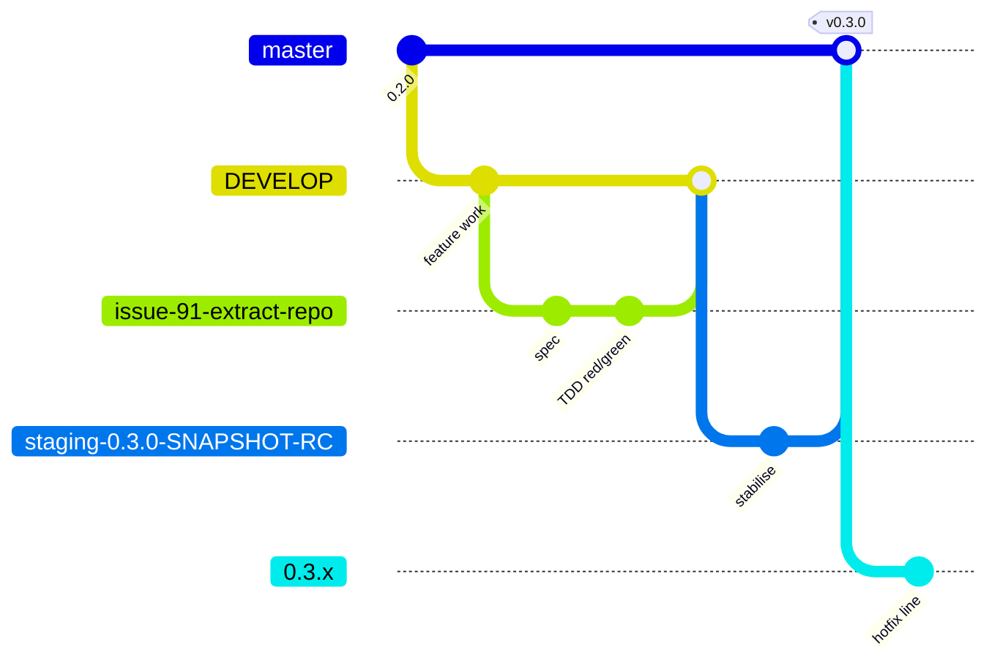
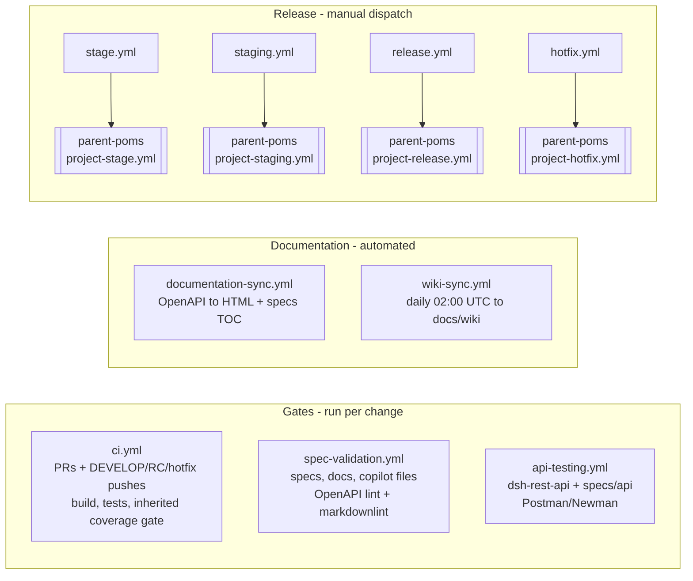

# DevOps: Branching, CI/CD and Release Pipeline

This document describes how code moves from a feature branch to a tagged release in the `dsh`
repository: the branching model, the GitHub Actions workflows that gate and automate that
movement, and the parent POM dependency that every build resolves against.

## Branching and Release Model

- Feature work branches off `DEVELOP` (e.g. `issue-91-extract-repo`) and merges back into
  `DEVELOP` once a PR passes CI.
- `DEVELOP` is periodically staged into a release-candidate branch named
  `staging-<version>-SNAPSHOT-RC` (e.g. `staging-0.3.0-SNAPSHOT-RC`), which is stabilised and
  eventually merged into `master` with a version tag (e.g. `v0.3.0`).
- Each release on `master` also opens a hotfix line branch named `<version>.x` (e.g. `0.3.x`) for
  patches against that release without pulling in unreleased `DEVELOP` work.
- The four release transitions above (stage, staging stabilisation, release-to-master, hotfix) are
  each driven by a manually dispatched workflow — see the Pipeline Map below.

## Pipeline Map

This diagram was checked node-for-node against the live YAML in `.github/workflows/` (see the
table below) and matches it; no trigger shown here is invented.

## Workflow Reference

| Workflow | Trigger(s) | What it gates / does |
| --- | --- | --- |
| `ci.yml` | `pull_request` (any branch); `push` to `DEVELOP`, `staging-*-RC`, `*.x`; `workflow_dispatch` | Builds and tests all modules (`mvn -B -U install`). That single command *is* the coverage gate: `jacoco:check` enforces a 95% LINE and BRANCH minimum per module, and `enforce-coverage-data-exists` fails a module that produced no coverage data at all. Both are bound to `verify` and inherited from `parent-poms` rather than declared here. This is the primary correctness gate. |
| `spec-validation.yml` | `push` and `pull_request`, both scoped to paths `specs/**`, `docs/**`, `.github/copilot-instructions.md`, `.github/copilot/**`, `.github/roles.md`, `.markdownlint.json`, `CLAUDE.md`, `.claude/**` | Lints the OpenAPI spec with Redocly, lints Markdown under `specs/`, `.github/`, `docs/` (excluding `docs/wiki/**`), `CLAUDE.md` and `.claude/` with markdownlint, and checks references from `copilot-instructions.md` — this last check is advisory only: it prints a `WARNING` per unresolved reference but always exits 0, so it never fails the job. |
| `api-testing.yml` | `push` to `DEVELOP`/`main` and `pull_request`, both scoped to paths `dsh-rest-api/**`, `specs/api/**`; `workflow_dispatch` | Builds the full project, boots `dsh-rest-api` against MongoDB/RabbitMQ service containers, and runs the Postman collections in `specs/api/postman/` via Newman. |
| `documentation-sync.yml` | `push` to `DEVELOP`/`main`, scoped to paths `specs/api/openapi/**`, `specs/architecture/**`, `specs/features/**`, `docs/wiki/**`; `workflow_dispatch` | Two jobs: regenerates HTML API docs from the OpenAPI spec into `docs/api/`, and refreshes the table of contents in `specs/features/*.md` and `specs/architecture/*.md`. Both auto-commit with `[skip ci]`. |
| `wiki-sync.yml` | `schedule` (`0 2 * * *`, daily 02:00 UTC); `workflow_dispatch` | Because the cron fires on the default branch (`master`), a `redispatch` job re-triggers the workflow on `DEVELOP` when it isn't already running there; the `sync-wiki` job then copies the GitHub wiki's Markdown pages into `docs/wiki/` via a pull request. |
| `stage.yml` | `workflow_dispatch` only | Delegates to the reusable `project-stage.yml` workflow in `MRISS-Projects/parent-poms` to cut a `staging-<version>-SNAPSHOT-RC` branch from `DEVELOP`. |
| `staging.yml` | `workflow_dispatch` only | Delegates to `project-staging.yml` in `parent-poms` to stabilise/build an existing RC branch. |
| `release.yml` | `workflow_dispatch` only | Delegates to `project-release.yml` in `parent-poms` to promote an RC branch to a tagged release on `master` and open the next hotfix line. |
| `hotfix.yml` | `workflow_dispatch` only | Delegates to `project-hotfix.yml` in `parent-poms` to build/release a patch from an existing `<version>.x` hotfix branch. |

All four release workflows (`stage.yml`, `staging.yml`, `release.yml`, `hotfix.yml`) are thin
wrappers: they take `workflow_dispatch` inputs and pass them straight through to a reusable
workflow hosted in the separate `MRISS-Projects/parent-poms` repository, which does the actual
Maven release work. They are only ever started by a person from the Actions tab, never by a push
or PR.

## Secrets

Two credentials reach these workflows, and the split between them is deliberate: **a workflow that
builds pull-request code never receives `DEPLOY_TOKEN`.** Pull-request code is authored outside the
repository's review gate but compiles and runs inside the job, so any secret in that job's
environment is readable by it. The only credential such a job may hold is one that cannot write.

| Secret | Scope | Used by | Why |
| --- | --- | --- | --- |
| `PACKAGES_READ_TOKEN` | `read:packages` only | `ci.yml`, `api-testing.yml` | Resolving `com.mriss.mriss-parent:products` from the `MRISS-Projects/maven-repo` registry. Both workflows build pull-request code, so the credential they expose must not be able to write. |
| `DEPLOY_TOKEN` | write-capable | `documentation-sync.yml`, `stage.yml`, `staging.yml`, `release.yml`, `hotfix.yml` | Pushing auto-generated docs, and deploying artifacts via the reusable `parent-poms` workflows. None of these runs pull-request code on an automatic trigger — but see the dispatch caveat below. |

**The caveat: manual dispatch.** `documentation-sync.yml` declares `workflow_dispatch` alongside
its `push` trigger, and the four release wrappers are `workflow_dispatch` only. A dispatched run
executes the workflow file from whichever ref the operator selects, so it *can* be pointed at an
unmerged branch and will then check that branch out with `DEPLOY_TOKEN` in hand. That is a
deliberate act by somebody who already holds write access to this repository, not an avenue open to
a pull-request author — but it does mean the rule above is a statement about automatic triggers
rather than an absolute. Weigh that before adding `workflow_dispatch` to anything else that holds
`DEPLOY_TOKEN`.

`PACKAGES_READ_TOKEN` must be a **classic** Personal Access Token. Fine-grained tokens reach
organisation-owned packages only where the organisation has opted in; the classic PAT with
`read:packages` is the documented route for `maven.pkg.github.com`. Authentication is required even
though `MRISS-Projects/maven-repo` is public — the GitHub Packages Maven registry demands
credentials for anonymous-readable packages — which is why the credential is swapped here rather
than dropped.

Both `ci.yml` and `api-testing.yml` open with a `Verify package credentials are present` step that
fails with an explicit `::error::` annotation when the secret is missing. Without it an absent
secret surfaces much later as a Maven 401 on `com.mriss.mriss-parent:products`, which reads as a
broken parent rather than a missing credential.

The two remaining workflows hold neither secret, and that is not an oversight: `wiki-sync.yml` uses
the built-in `secrets.GITHUB_TOKEN`, and `spec-validation.yml` touches no Maven build and no package
registry.

## Parent POM

Every module in this repository inherits from `com.mriss.mriss-parent:products`, resolved from
the `MRISS-Projects/maven-repo` GitHub Packages registry (see the `<parent>` block in the root
`pom.xml`). CI (`ci.yml`) configures a Maven `settings.xml` with credentials for that registry and
builds with `mvn -B -U install`, as does `api-testing.yml`. Parent version upgrades are a
deliberate, manual edit to the root `pom.xml`, not something a workflow does automatically; `-U`
only refreshes the `SNAPSHOT` that `pom.xml` already names.

The current pin to `com.mriss.mriss-parent:products:3.8.0-SNAPSHOT` carries a known reproducibility
cost: the same commit in this repository can resolve a different parent POM — and therefore build
differently — from one run to the next.

**The SNAPSHOT pin is an accepted decision, not an oversight — do not "fix" it.** Upcoming work on
the `MRISS-Projects/parent-poms` project will change this repository, and tracking a `SNAPSHOT` is
how those changes reach it without cutting a parent release per iteration. Pinning a released
parent version is worth revisiting only once the `parent-poms` work has settled — it is Wave 0's
closing goal in `specs/product/PRD.md` §4.

**`-U` is how that decision is stated, not a mitigation of it.** Omitting the flag never bought
reproducibility, for two reasons: Maven refreshes `SNAPSHOT` metadata on its own daily schedule, so
the parent re-resolved anyway at a moment nobody chose; and `actions/setup-java` restores `~/.m2`
from a cache whose age varies run to run, so *whether* a given run saw a new parent depended on
state invisible in the build log. Passing `-U` everywhere makes the drift consistent and legible
instead of accidental. **When the parent is pinned to a released version, drop `-U`** — at that
point resolution is genuinely reproducible and the flag no longer earns its place.
