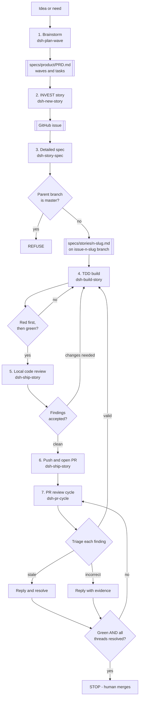

# The AI-driven development process

`CLAUDE.md` states the seven steps of this loop as a compact table and links here for the detail.
This document is that detail: for each step, what it takes as input, which skill does the work,
what artifact it produces, what the hard stop is, and what "done" looks like. Branch rules and
quality gates are defined once in `CLAUDE.md` and referenced, not restated, below.

**Status of the six project skills.** `dsh-plan-wave`, `dsh-new-story`, `dsh-story-spec`,
`dsh-build-story`, `dsh-ship-story` and `dsh-pr-cycle` are specified here as the process's entry
points. They exist in the repo today, under `.claude/skills/<name>/SKILL.md`. What has not been
verified is whether
they successfully *load* in a running Claude Code session — skill discovery happens at startup, so
confirming that needs a restart against this branch. Treat the descriptions below as the contract
each skill's `SKILL.md` must satisfy, not as confirmation that a session has already loaded them.

## The loop



Four edges loop backward, and each one matters: a red test that fails for the wrong reason sends
step 4 back into step 4 (`K -->|no| J`); review findings that need changes send step 5 back into
step 4 (`M -->|changes needed| J`); a *valid* PR finding sends step 7 back into step 4
(`R -->|valid| J`), because a fix is still code and still gets a failing test first; and a round
that has not converged sends step 7 back into itself (`U -->|no| Q`).

Note what the triage node does **not** do: it does not route every finding to a fix. Stale and
incorrect findings leave through reply edges without touching the code. That asymmetry is the
point of the step.

## Step 1: Brainstorm, then update the PRD with waves

**Input.** An idea, a need, or an untriaged backlog item — including an existing open GitHub issue
that has not yet been placed into a PRD wave.

**Skill.** `dsh-plan-wave`, which hands off to `superpowers:brainstorming` to explore the idea
(scope, alternatives, open questions) before anything is written down.

**Artifact.** An updated `specs/product/PRD.md`: a new or amended wave with its tasks listed under
it.

**Hard stop.** The owner approves the wave content before it is written to the PRD. Brainstorming
output is not committed on the owner's behalf.

**Done looks like.** `specs/product/PRD.md` reflects the agreed wave breakdown, with no dangling
brainstorm state — the next reader can pick a task straight from the PRD and start step 2.

## Step 2: Turn a PRD task into an INVEST story on GitHub

**Input.** One task line from a PRD wave (from step 1's output, or any task already sitting in the
PRD from an earlier pass).

**Skill.** `dsh-new-story`, which shapes the task into an INVEST story — Independent, Negotiable,
Valuable, Estimable, Small, Testable — as a GitHub issue body.

**Artifact.** A GitHub issue, numbered, with an INVEST-shaped body that links back to its PRD wave
and task.

**Hard stop.** The owner approves the issue body before `dsh-new-story` runs `gh issue create`.
Claude drafts; it does not publish unreviewed issue text.

**Done looks like.** The issue exists on GitHub with a number, ready to be referenced as `issue:
<n>` in step 3's front matter.

## Step 3: Turn the story into a reviewed spec on the task branch

**Input.** The GitHub issue number from step 2.

**Skill.** `dsh-story-spec`, which hands off to `superpowers:brainstorming` and `writing-plans`.
This is the one skill in the process that carries real logic of its own: it resolves the parent
branch and **refuses to proceed if the resolved parent is `master`**. Per the branch rules in
`CLAUDE.md`, the legal parents are `DEVELOP`, a `staging-*-RC` branch, or a `*.x` hotfix branch —
never `master`.

**Artifact.** A task branch `issue-<n>-<slug>` cut from the resolved parent, with
`specs/stories/<n>-<slug>.md` committed on it, front matter filled in per the contract below.

**Hard stop.** Two, both absolute for different reasons: the `master`-as-parent check is a refusal
the skill enforces itself (see the `G -->|yes| H["REFUSE"]` branch in the diagram above); the
owner's approval of the spec content before commit/push is a human checkpoint the skill defers to.

**Done looks like.** The spec is committed on the task branch, every front-matter field is filled
in and correct, and the owner has signed off on the spec's content — the branch is now ready for
step 4 to build against.

## Step 4: Build the spec with TDD — red first, then green

**Input.** The reviewed spec on the task branch, with front matter intact.

**Skill.** `dsh-build-story`, which hands off to `superpowers:test-driven-development` and
`executing-plans`.

**Artifact.** Code and tests satisfying the spec, one increment at a time.

**Hard stop.** Each test must fail first, and fail **for the right reason** — demonstrating the
absence of the behaviour under test, not failing on a compile error, a typo, or an unrelated
assertion — before it is made to pass. A red test that fails for the wrong reason is not a valid
red; the loop stays at step 4 until it is (`K -->|no| J` in the diagram).

**Done looks like.** Every item in the spec has a red-then-green cycle behind it, and
`mvn -B install` passes locally — the increment is ready for review.

## Step 5: Local code review

**Input.** The completed implementation on the task branch, `mvn -B install` green locally.

**Skill.** `dsh-ship-story` (shared with step 6, see below), which hands off to `/code-review` and
`superpowers:receiving-code-review`.

**Artifact.** Review findings — a list of issues, questions, or a clean bill of health.

**Hard stop.** The owner reads the findings before any fix lands. Findings that require changes
send the work back to step 4 (`M -->|changes needed| J`); this is a real gate, not a formality,
even though it shares a skill with step 6.

**Done looks like.** Findings are either accepted as clean with no changes needed, or every
required change has been made and re-reviewed until it is.

## Step 6: Commit, push, open the pull request

**Input.** A clean review from step 5.

**Skill.** `dsh-ship-story`, which hands off to `verification-before-completion`.

**Artifact.** A pushed branch and an open pull request, with the first CI run started.
`.github/workflows/ci.yml` enforces the quality gates defined in `CLAUDE.md` — all tests passing
under `mvn -B install` and the coverage ratchet against `.github/coverage-baseline.txt` — on every
PR. Everything currently runs under surefire; there is no failsafe configuration and no `*IT.java`
test in the repo, so integration tests are not yet a gate CI enforces separately from unit tests.
Implementing them is tracked as `#46` in PRD Wave 0.

**Hard stop.** The owner approves the PR title, body and base branch **before** the push. `--base`
is never `master`; if the story spec's front matter says `master`, something went wrong in step 3.

**Done looks like.** The PR is open and CI is running. Everything that happens on the PR after
that — CI results, Copilot comments, human comments — is step 7.

## Step 7: The PR review cycle

**Input.** An open pull request with a failed check or an unresolved review thread.

**Skill.** `dsh-pr-cycle`, which hands off to `superpowers:receiving-code-review`. It is
**invocable on its own**: a review round often arrives hours or days after the PR opened, in a
fresh session, and handling it must not mean re-running steps 5 and 6.

**Artifact.** Commits that fix valid findings, replies on every thread, and a green PR.

This step **repeats**. One round is: read the state from GitHub, triage the findings, fix or
answer them, push once, re-verify.

**Triage is the substance of this step, and the reason it is written down.** A review comment is a
claim, not an instruction. Check each finding three ways:

| Check | Why it matters |
|---|---|
| Is it still true at current HEAD? | Reviews are pinned to the commit they ran against; later commits may already have fixed it. A stale finding needs a reply, not a patch. |
| Is the stated mechanism right, or only the conclusion? | A finding can be right for the wrong reason. Fixing what it *says* rather than what is *wrong* fixes nothing. |
| Would the proposed remedy actually work? | Reviewers suggest fixes without running them. |

This is not hypothetical. On PR #91 — the pull request that introduced this process — seven
automated review comments produced: two already fixed by later commits, one whose conclusion was
right but whose stated mechanism was wrong, and one whose proposed remedy would not have worked.
Four of seven needed an answer rather than obedience. A step that said "address the review
comments" would have made the code worse.

**Mechanics.** One commit per fix, so each is reviewable and revertible alone. One push per round,
so CI runs track rounds rather than individual commits. A reply on every finding, including the
ones you fix, naming the commit and — where you disagreed — showing the evidence.

**Hard stop.** Claude never merges the PR and never closes the originating issue. Claude does not
resolve a thread whose resolution the owner has not seen: stale findings that have been answered
may be resolved, but a thread for a finding Claude *fixed* stays open so the owner can check the
fix, unless they say otherwise.

**Done looks like.** Every check green **and** every review thread resolved. Green alone is not
done — a PR can be green with seven open conversations on it.

## Story spec front matter

`dsh-story-spec` writes machine-readable front matter at the top of every story spec so that later
steps do not need to re-derive state that is already known. `dsh-ship-story` parses this block
directly — the keys are a contract, not a suggestion:

```yaml
---
issue: 91
slug: extract-document-persistence-repository
parent_branch: DEVELOP
wave: 1
milestone: 0.4.0-SNAPSHOT
---
```

`dsh-ship-story` reads `parent_branch` to target the pull request. This is the single piece of
state that couples step 3 to step 6; everything else a later step needs is derived from the issue
or from the working tree at the time.

## Working across the parent-poms boundary

DSH is not self-contained. It inherits from `com.mriss.mriss-parent:products`, maintained in
[`MRISS-Projects/parent-poms`](https://github.com/MRISS-Projects/parent-poms), and that repo owns
the build and release machinery: plugin versions and configuration, the coverage gate, the reusable
release workflows, Maven site generation.

**The failure mode this section exists to prevent** is diagnosing a build problem by grepping only
this repository, concluding something is missing, and building a local replacement for it. That
happened during this process's own construction: the initial gap analysis reported "no JaCoCo
coverage threshold exists in any pom" and a script-based coverage ratchet was written to fill the
gap. The threshold was there all along — `jacoco:check` at 95% is inherited from parent-poms and
runs on every module — it simply was not in a file this repository contains. When the build does
something you cannot explain from the local poms, read the parent before concluding it is absent.

### When a change belongs in parent-poms

Any change to pom structure that another project could reuse. Also any bug whose root cause is in
the inherited structure rather than in DSH code — Maven site generation, gh-pages publishing,
plugin versions, release/stage/hotfix workflow behaviour, coverage thresholds.

### The round trip

1. **Open an issue in `parent-poms`.** A plain issue is enough — INVEST framing is for product
   stories, and parent-poms is infrastructure. Its repo keeps a deliberately lightweight Claude
   configuration, and this seven-step process is not ported there.
2. **Ensure the next milestone there is open as a `-SNAPSHOT`.**
3. **Implement and test it in parent-poms** against that `-SNAPSHOT`.
4. **Validate end to end from DSH** by temporarily pointing this repo's root `pom.xml` at that
   `-SNAPSHOT` parent.
5. **Close the issue and release parent-poms.** Its release script already exists.
6. **Re-pin this repo's root `pom.xml`** to the newly released version.

### Clear the milestone before releasing it

If the milestone being released still has open issues, fix them first — including ones unrelated to
the change that prompted the release. A release whose own milestone is half-done makes the version
number meaningless, and the next project to inherit it cannot tell what it is getting.

### Why this is a rule and not a judgement call

The alternative — fixing shared build behaviour locally because it is faster — produces a
divergence that only shows up when the next project inherits the parent and finds the fix missing.
The cost of the round trip is paid once; the cost of divergence is paid by every project after.

## Why Claude stops at green

Step 2 ends with Claude opening a GitHub issue. Step 6 ends with Claude opening a pull request, and
step 7 ends with that PR green and its threads resolved. All of those actions are reversible and
reviewable: an issue can be edited or closed, a PR can be revised, retargeted, or closed without
ever having touched `master`, and a reply on a review thread can be corrected. None of them commits
the repository owner to anything irreversible.

Closing an issue and merging a pull request are different in kind, not just in degree. A merge
changes the branch history other people build on; a closed issue stops being visible work in
progress. Both are judgment calls about whether the work is actually finished and actually wanted
— calls that belong to whoever owns the repository, not to the agent that did the work. So Claude
never performs either action: it creates issues and PRs only after the owner approves their
content, and it stops once CI is green and the review threads are resolved, leaving the merge
itself to the owner.

Resolving a review thread sits just inside that line, and step 7 treats it carefully. Resolving
hides a conversation from the default view, so Claude resolves only threads whose outcome the owner
has already seen — a stale finding that has been answered, for instance. A thread for a finding
Claude *fixed* stays open by default, because the owner may want to check the fix before the
discussion disappears.
