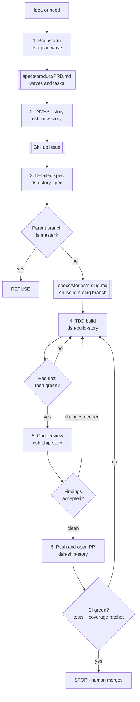

# The AI-driven development process

`CLAUDE.md` states the six steps of this loop as a compact table and links here for the detail.
This document is that detail: for each step, what it takes as input, which skill does the work,
what artifact it produces, what the hard stop is, and what "done" looks like. Branch rules and
quality gates are defined once in `CLAUDE.md` and referenced, not restated, below.

**Status of the five project skills.** `dsh-plan-wave`, `dsh-new-story`, `dsh-story-spec`,
`dsh-build-story` and `dsh-ship-story` are specified here as the process's entry points. They exist
in the repo today, under `.claude/skills/<name>/SKILL.md`. What has not been verified is whether
they successfully *load* in a running Claude Code session — skill discovery happens at startup, so
confirming that needs a restart against this branch. Treat the descriptions below as the contract
each skill's `SKILL.md` must satisfy, not as confirmation that a session has already loaded them.

## The loop



Three edges loop backward, and each one matters: a red test that fails for the wrong reason sends
step 4 back into step 4 (`K -->|no| J`); review findings that need changes send step 5 back into
step 4 (`M -->|changes needed| J`); a red CI run sends step 6 back into step 4 (`O -->|no| J`).
Nothing downstream of "code exists" is trusted until it has been re-verified from the build up.

## Step 1: Brainstorm, then update the PRD with waves

**Input.** An idea, a need, or an untriaged backlog item — including an existing open GitHub issue
that has not yet been placed into a PRD wave.

**Skill.** `dsh-plan-wave`, which hands off to `superpowers:brainstorming` to explore the idea
(scope, alternatives, open questions) before anything is written down.

**Artifact.** An updated `specs/product/PRD.md`: a new or amended wave with its tasks listed under
it.

**Hard stop.** The owner approves the wave content before it is written to the PRD. Brainstorming
output is not committed on the owner's behalf.

**Done looks like.** `specs/product/PRD.md` reflects the agreed wave breakdown, with no dangling
brainstorm state — the next reader can pick a task straight from the PRD and start step 2.

## Step 2: Turn a PRD task into an INVEST story on GitHub

**Input.** One task line from a PRD wave (from step 1's output, or any task already sitting in the
PRD from an earlier pass).

**Skill.** `dsh-new-story`, which shapes the task into an INVEST story — Independent, Negotiable,
Valuable, Estimable, Small, Testable — as a GitHub issue body.

**Artifact.** A GitHub issue, numbered, with an INVEST-shaped body that links back to its PRD wave
and task.

**Hard stop.** The owner approves the issue body before `dsh-new-story` runs `gh issue create`.
Claude drafts; it does not publish unreviewed issue text.

**Done looks like.** The issue exists on GitHub with a number, ready to be referenced as `issue:
<n>` in step 3's front matter.

## Step 3: Turn the story into a reviewed spec on the task branch

**Input.** The GitHub issue number from step 2.

**Skill.** `dsh-story-spec`, which hands off to `superpowers:brainstorming` and `writing-plans`.
This is the one skill in the process that carries real logic of its own: it resolves the parent
branch and **refuses to proceed if the resolved parent is `master`**. Per the branch rules in
`CLAUDE.md`, the legal parents are `DEVELOP`, a `staging-*-RC` branch, or a `*.x` hotfix branch —
never `master`.

**Artifact.** A task branch `issue-<n>-<slug>` cut from the resolved parent, with
`specs/stories/<n>-<slug>.md` committed on it, front matter filled in per the contract below.

**Hard stop.** Two, both absolute for different reasons: the `master`-as-parent check is a refusal
the skill enforces itself (see the `G -->|yes| H["REFUSE"]` branch in the diagram above); the
owner's approval of the spec content before commit/push is a human checkpoint the skill defers to.

**Done looks like.** The spec is committed on the task branch, every front-matter field is filled
in and correct, and the owner has signed off on the spec's content — the branch is now ready for
step 4 to build against.

## Step 4: Build the spec with TDD — red first, then green

**Input.** The reviewed spec on the task branch, with front matter intact.

**Skill.** `dsh-build-story`, which hands off to `superpowers:test-driven-development` and
`executing-plans`.

**Artifact.** Code and tests satisfying the spec, one increment at a time.

**Hard stop.** Each test must fail first, and fail **for the right reason** — demonstrating the
absence of the behaviour under test, not failing on a compile error, a typo, or an unrelated
assertion — before it is made to pass. A red test that fails for the wrong reason is not a valid
red; the loop stays at step 4 until it is (`K -->|no| J` in the diagram).

**Done looks like.** Every item in the spec has a red-then-green cycle behind it, and
`mvn -B install` passes locally — the increment is ready for review.

## Step 5: Code review

**Input.** The completed implementation on the task branch, `mvn -B install` green locally.

**Skill.** `dsh-ship-story` (shared with step 6, see below), which hands off to `/code-review` and
`superpowers:receiving-code-review`.

**Artifact.** Review findings — a list of issues, questions, or a clean bill of health.

**Hard stop.** The owner reads the findings before any fix lands. Findings that require changes
send the work back to step 4 (`M -->|changes needed| J`); this is a real gate, not a formality,
even though it shares a skill with step 6.

**Done looks like.** Findings are either accepted as clean with no changes needed, or every
required change has been made and re-reviewed until it is.

## Step 6: Commit, push, CI green, then merge

**Input.** A clean review from step 5.

**Skill.** `dsh-ship-story`, which hands off to `verification-before-completion` and
`finishing-a-development-branch`.

**Artifact.** A pushed branch, an open pull request, and (if the run succeeds) a green CI run.
`.github/workflows/ci.yml` enforces the quality gates defined in `CLAUDE.md` — all tests passing
under `mvn -B install` and the coverage ratchet against `.github/coverage-baseline.txt` — on every
PR. Everything currently runs under surefire; there is no failsafe configuration and no `*IT.java`
test in the repo, so integration tests are not yet a gate CI enforces separately from unit tests.
Implementing them is tracked as `#46` in PRD Wave 0.

**Hard stop.** Claude commits, pushes, and opens the pull request, then **stops**. A red CI run
sends the work back to step 4 (`O -->|no| J`). A green CI run is also a stop: Claude never merges
the PR and never closes the originating issue — see "Why Claude stops at green" below.

**Done looks like, for Claude.** The PR is open, CI is green against the gates it actually
enforces, and the PR is left for the repo owner. Merging is the owner's action and is outside what
this process asks Claude to do.

## Story spec front matter

`dsh-story-spec` writes machine-readable front matter at the top of every story spec so that later
steps do not need to re-derive state that is already known. `dsh-ship-story` parses this block
directly — the keys are a contract, not a suggestion:

```yaml
---
issue: 91
slug: extract-document-persistence-repository
parent_branch: DEVELOP
wave: 1
milestone: 0.4.0-SNAPSHOT
---
```

`dsh-ship-story` reads `parent_branch` to target the pull request. This is the single piece of
state that couples step 3 to step 6; everything else a later step needs is derived from the issue
or from the working tree at the time.

## Why Claude stops at green

Step 2 ends with Claude opening a GitHub issue. Step 6 ends with Claude opening a pull request and
watching CI turn green. Both of those actions are reversible and reviewable: an issue can be
edited or closed, a PR can be revised, retargeted, or closed without ever having touched `master`.
Neither one commits the repository owner to anything irreversible on its own.

Closing an issue and merging a pull request are different in kind, not just in degree. A merge
changes the branch history other people build on; a closed issue stops being visible work in
progress. Both are judgment calls about whether the work is actually finished and actually wanted
— calls that belong to whoever owns the repository, not to the agent that did the work. So Claude
never performs either action: it creates issues and PRs only after the owner approves their
content, and it stops the moment CI is green, leaving the merge itself to the owner.
