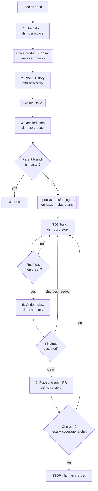
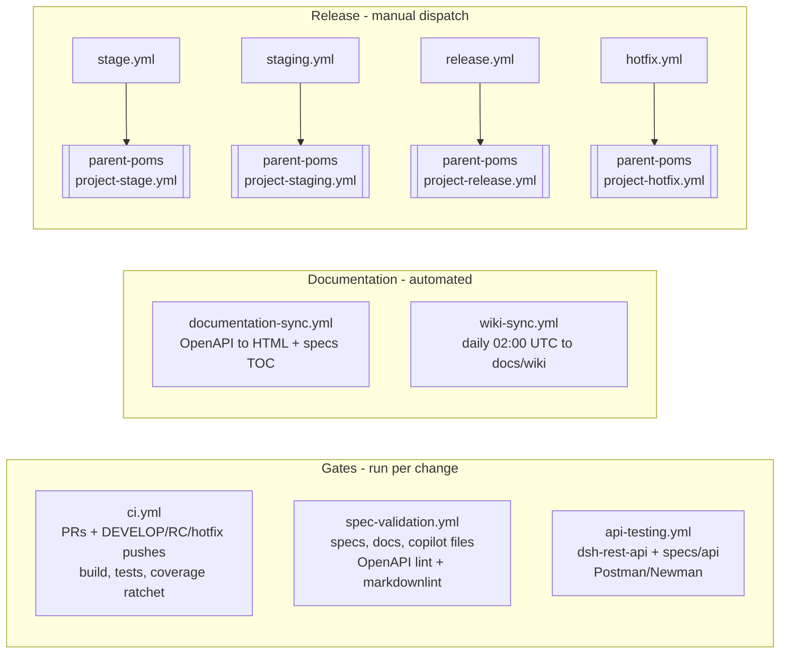

# AI-Driven Development Process Implementation Plan

> **For agentic workers:** REQUIRED SUB-SKILL: Use superpowers:subagent-driven-development (recommended) or superpowers:executing-plans to implement this plan task-by-task. Steps use checkbox (`- [ ]`) syntax for tracking.

**Goal:** Initialise the DSH repository for Claude Code and encode a 6-step AI-driven development process, closing the four gaps that currently prevent that process from running.

**Architecture:** `CLAUDE.md` is a thin router that delegates all standards to the existing `.github/copilot-instructions.md`. The process is enforced by five project skills under `.claude/skills/` that supply DSH-specific context and hand off to Superpowers skills. A new `ci.yml` supplies the missing merge gate, with a coverage ratchet implemented in a shell script so that no pom is modified.

**Tech Stack:** GitHub Actions, Maven 3.9 multi-module, Java 17 (Temurin), JaCoCo 0.8.3, markdownlint-cli, Mermaid, `gh` CLI.

**Spec:** `docs/superpowers/specs/2026-09-16-ai-driven-development-process-design.md`

## Global Constraints

- **Never delete `install-parent-pom.sh` or `parent-pom.xml`.** `build-ci*.sh` still reference them. Add deprecation headers only. Removal is a Wave 0 story. (Spec G5, §4.6)
- **Never run `install-parent-pom.sh` in any new workflow.** The parent resolves from GitHub Packages via `settings.xml`. (Spec D5)
- **Never pass `-U` to Maven in `ci.yml`.** The parent is a SNAPSHOT; `-U` forces drift. (Spec §2.1)
- **Never modify any `pom.xml`.** The coverage gate lives outside the build. (Spec D3)
- **Coverage metric is `INSTRUCTION`**, matching the existing `jacoco-badge-maven-plugin` config in `dsh-coverage-report/pom.xml` (`<metric>instruction</metric>`, `<passing>70</passing>`).
- **`CLAUDE.md` restates no standard.** It routes to `.github/copilot-instructions.md`. Any duplicated rule is a defect. (Spec D1)
- **Claude never closes issues and never merges PRs.** (Spec D4)
- **Task branches never originate from `master`.** Legal parents: `DEVELOP`, `staging-*-RC`, `*.x`. (Spec D6)
- **Every new Markdown file must pass `markdownlint` with the repo config** from Task 1 onward.
- Current branch for all work: `init-claude-ai-driven-process` (cut from `staging-0.3.0-SNAPSHOT-RC`).

### This box has no Node.js and no Python

**Never call `npx`, `npm`, `node`, `python`, `pip` expecting them on PATH.** `python` and
`python3` resolve to Windows Store stubs that print a Portuguese "not found" message and exit
non-zero — they satisfy `command -v` but cannot run anything.

Tooling lives as standalone zip builds under `~/apps`, and PATH is set **per command**:

```bash
export PATH="$HOME/apps/node-v24.21.0-win-x64:$PATH"
markdownlint --version    # 0.49.1
```

Every `markdownlint` invocation in this plan requires that `export` line first. `markdownlint-cli`
is already installed globally into that Node prefix; do not re-install it, and do not install
anything system-wide.

Also on this box: `mvn` is `~/apps/apache-maven-3.9.16` (already on PATH). Bare `java -version`
reports a system **JDK 24**, but `JAVA_HOME` is already set to `~/apps/jdk-17.0.20.1+1` and Maven
prefers `JAVA_HOME` over PATH — so `mvn -version` reports **17.0.20.1** and builds already match
CI with no override. Verified 2026-09-16 against a full `mvn install` (13/13 modules, `javac
[debug target 17]` throughout). Do not "fix" this by setting `JAVA_HOME`; it is already correct.

### Running local Maven commands

**Every local `mvn` invocation redirects to a log file under `.logs/` and prints a `tail`
command before blocking.** DSH is a 13-module reactor; a full build with tests is long enough
that a silent blocking command leaves the human with nothing to watch. Always use this shape:

```bash
mkdir -p .logs
mvn -B install > .logs/mvn-install.log 2>&1 &
MVN_PID=$!
echo "Monitor with:  tail -f .logs/mvn-install.log"
wait $MVN_PID; echo "maven exit=$?"
```

Rules:

- Name the log after the command: `.logs/mvn-install.log`, `.logs/mvn-validate.log`,
  `.logs/mvn-badges.log`. Do not reuse one name for different commands.
- Print the `tail -f` line **before** `wait`, so the human can start monitoring immediately.
- Always report the exit code explicitly. `wait` returns the job's status; a bare `mvn ... &`
  with no `wait` silently reports success.
- Never pipe `mvn` straight to `tail`/`head` without a log file — that discards the diagnostic
  output you need when the build fails, and `$?` becomes the pipe's status, not Maven's.
- `.logs/` is gitignored. Never commit a build log.
- **This applies to local runs only.** Inside `ci.yml`, Maven writes to the Actions log; do not
  redirect there.

---

### Task 1: Make the Markdown lint gate real

Closes spec gap G3. This task comes first because every later task adds Markdown that must pass this gate.

**Files:**

- Create: `.markdownlint.json`
- Modify: `.github/workflows/spec-validation.yml` (the `Lint markdown files` step, currently ending in `|| true`)

**Interfaces:**

- Consumes: nothing.
- Produces: a lint configuration that all later Markdown must satisfy. Later tasks rely on the command `markdownlint 'specs/**/*.md' '.github/**/*.md' 'docs/**/*.md' --ignore 'docs/wiki/**' --config .markdownlint.json` exiting 0.

- [ ] **Step 1: Observe the current failure**

The gate cannot currently fail, so first find out what it *would* say.

```bash
cd /c/Users/marce/github/dsh
markdownlint 'specs/**/*.md' '.github/**/*.md' 'docs/**/*.md' \
  --ignore 'docs/wiki/**' 2>&1 | tee /tmp/md-before.txt | tail -40
echo "violation count: $(grep -c ':' /tmp/md-before.txt)"
```

Expected: a non-zero number of violations, dominated by `MD013/line-length`, `MD033/no-inline-html` and `MD041/first-line-heading`. Record which rule IDs actually appear — the next step disables exactly those and nothing more.

- [ ] **Step 2: Write the config**

Disable only rules that fire on existing, intentional content. `MD013` is off because the specs use wide tables; `MD033` is off because `system-design.md` and the issue templates use inline HTML; `MD024` is scoped to siblings because ADRs legitimately repeat headings.

`MD046` (code-block style) is off deliberately: `CLAUDE.md` and the five skill files created by
Tasks 3 and 6 use 4-space indented blocks, while `CLAUDE.md` also uses fenced blocks — so both
`"fenced"` and `"consistent"` would reject files this same plan creates.

```json
{
  "default": true,
  "MD013": false,
  "MD024": { "siblings_only": true },
  "MD033": false,
  "MD041": false,
  "MD046": false
}
```

- [ ] **Step 3: Verify the config makes the suite pass**

```bash
markdownlint 'specs/**/*.md' '.github/**/*.md' 'docs/**/*.md' \
  --ignore 'docs/wiki/**' --config .markdownlint.json
echo "exit=$?"
```

Expected: `exit=0`. If not, fix the *files* that violate a rule worth keeping, and only disable a rule when the violation is intentional. Do not blanket-disable to force green — a lint gate tuned to pass everything is the same decoration we are removing.

- [ ] **Step 4: Remove the `|| true` so the gate has teeth**

In `.github/workflows/spec-validation.yml`, the step currently reads:

```yaml
      - name: Lint markdown files
        run: |
          markdownlint 'specs/**/*.md' '.github/**/*.md' 'docs/**/*.md' \
            --ignore 'docs/wiki/**' \
            --config .markdownlint.json || true
```

Change the final line to drop `|| true`:

```yaml
      - name: Lint markdown files
        run: |
          markdownlint 'specs/**/*.md' '.github/**/*.md' 'docs/**/*.md' \
            --ignore 'docs/wiki/**' \
            --config .markdownlint.json
```

- [ ] **Step 5: Commit**

```bash
git add .markdownlint.json .github/workflows/spec-validation.yml
git commit -m "ci: add markdownlint config and make the lint gate enforcing

spec-validation.yml referenced .markdownlint.json, which did not exist,
and swallowed all failures with a trailing '|| true'. Adds the config
tuned to pass on existing content, then removes the '|| true' so the
check can actually fail.

Co-Authored-By: Claude Opus 5 <noreply@anthropic.com>"
```

---

### Task 2: CI workflow and coverage ratchet

Closes spec gaps G1 and G2. This is the gate step 6 of the process depends on.

**Files:**

- Create: `scripts/check-coverage.sh`
- Create: `.github/workflows/ci.yml`
- Create: `.github/coverage-baseline.txt` (bootstrapped in Step 7, from a real run — never guessed)

**Interfaces:**

- Consumes: `.markdownlint.json` from Task 1 (unrelated, but Task 1's commit must land first so CI starts green).
- Produces: `scripts/check-coverage.sh <csv-path> <baseline-path>` → exits 0 if current ≥ baseline, exits 1 otherwise, prints `current=NN.NN baseline=NN.NN` on stdout in both cases. Task 3 documents this command in `CLAUDE.md`; Task 6's `dsh-build-story` skill invokes it as the local gate.

- [ ] **Step 1: Write the failing test for the coverage script**

There is no test framework for shell in this repo, so the test is an executable fixture-driven script. Create `scripts/test-check-coverage.sh`:

```bash
#!/usr/bin/env bash
# Fixture-driven tests for check-coverage.sh
set -uo pipefail
cd "$(dirname "$0")/.."
TMP=$(mktemp -d)
trap 'rm -rf "$TMP"' EXIT
fail=0

# JaCoCo CSV header, then two packages: 300 missed, 700 covered => 70.00%
cat > "$TMP/jacoco.csv" <<'CSV'
GROUP,PACKAGE,CLASS,INSTRUCTION_MISSED,INSTRUCTION_COVERED,BRANCH_MISSED,BRANCH_COVERED,LINE_MISSED,LINE_COVERED,COMPLEXITY_MISSED,COMPLEXITY_COVERED,METHOD_MISSED,METHOD_COVERED
dsh,com.mriss.a,A,100,400,0,0,0,0,0,0,0,0
dsh,com.mriss.b,B,200,300,0,0,0,0,0,0,0,0
CSV

check() { # name expected_exit baseline
  echo "$3" > "$TMP/baseline.txt"
  out=$(./scripts/check-coverage.sh "$TMP/jacoco.csv" "$TMP/baseline.txt"); rc=$?
  if [ "$rc" -ne "$2" ]; then
    echo "FAIL: $1 (exit $rc, wanted $2) :: $out"; fail=1
  else
    echo "PASS: $1"
  fi
}

check "equal to baseline passes"   0 "70.00"
check "above baseline passes"      0 "65.00"
check "below baseline fails"       1 "75.00"

# Missing baseline file bootstraps and passes
rm -f "$TMP/baseline.txt"
out=$(./scripts/check-coverage.sh "$TMP/jacoco.csv" "$TMP/baseline.txt"); rc=$?
if [ "$rc" -eq 0 ] && echo "$out" | grep -q "bootstrap"; then
  echo "PASS: missing baseline bootstraps"
else
  echo "FAIL: missing baseline bootstraps (exit $rc) :: $out"; fail=1
fi

# Missing CSV is a hard error, not a silent pass
out=$(./scripts/check-coverage.sh "$TMP/nope.csv" "$TMP/baseline.txt" 2>&1); rc=$?
if [ "$rc" -eq 2 ]; then echo "PASS: missing csv errors"; else
  echo "FAIL: missing csv errors (exit $rc) :: $out"; fail=1; fi

exit $fail
```

- [ ] **Step 2: Run it to confirm it fails**

```bash
chmod +x scripts/test-check-coverage.sh
./scripts/test-check-coverage.sh
```

Expected: FAIL — every case errors because `scripts/check-coverage.sh` does not exist yet.

- [ ] **Step 3: Write the coverage script**

Create `scripts/check-coverage.sh`:

```bash
#!/usr/bin/env bash
# Coverage ratchet: fail if aggregate INSTRUCTION coverage drops below the
# committed baseline. Deliberately implemented outside the poms so that
# release builds inheriting from com.mriss.mriss-parent:products are unaffected.
#
# Usage: check-coverage.sh <jacoco-csv> <baseline-file>
set -uo pipefail

CSV="${1:-dsh-coverage-report/target/site/jacoco-aggregate/jacoco.csv}"
BASELINE_FILE="${2:-.github/coverage-baseline.txt}"

if [ ! -f "$CSV" ]; then
  echo "ERROR: JaCoCo CSV not found at '$CSV'." >&2
  echo "The aggregate report is produced by jacoco:report-aggregate, bound to" >&2
  echo "the 'verify' phase in dsh-coverage-report/pom.xml. Run 'mvn -B install'." >&2
  exit 2
fi

# Columns 4 and 5 are INSTRUCTION_MISSED and INSTRUCTION_COVERED.
current=$(awk -F, 'NR>1 {m+=$4; c+=$5} END {
  if (m+c == 0) printf "0.00"; else printf "%.2f", 100*c/(m+c)
}' "$CSV")

if [ ! -f "$BASELINE_FILE" ]; then
  echo "bootstrap: no baseline at '$BASELINE_FILE'; current=$current"
  echo "Commit this value to establish the ratchet:"
  echo "  echo $current > $BASELINE_FILE"
  exit 0
fi

baseline=$(tr -d '[:space:]' < "$BASELINE_FILE")
echo "current=$current baseline=$baseline"

if awk -v c="$current" -v b="$baseline" 'BEGIN { exit !(c + 0.005 < b) }'; then
  echo "FAIL: coverage dropped from $baseline% to $current%." >&2
  echo "Add tests, or justify the drop and update $BASELINE_FILE deliberately." >&2
  exit 1
fi

echo "OK: coverage $current% >= baseline $baseline%"
exit 0
```

- [ ] **Step 4: Run the tests to verify they pass**

```bash
chmod +x scripts/check-coverage.sh
./scripts/test-check-coverage.sh
```

Expected: five `PASS:` lines, exit 0.

- [ ] **Step 5: Write the CI workflow**

Create `.github/workflows/ci.yml`. The Maven settings block and the Mongo bootstrap are lifted verbatim from `.github/workflows/api-testing.yml` so the two stay consistent.

`push` covers only the long-lived branches and `pull_request` covers everything else — this avoids every task-branch PR running the full build twice.

```yaml
name: CI

on:
  pull_request:
  push:
    branches:
      - DEVELOP
      - 'staging-*-RC'
      - '*.x'
  workflow_dispatch:

concurrency:
  group: ${{ github.workflow }}-${{ github.ref }}
  cancel-in-progress: true

jobs:
  build:
    name: Build, Test and Coverage Gate
    runs-on: ubuntu-latest
    permissions:
      contents: read

    services:
      mongodb:
        image: mongo:6
        ports:
          - 27017:27017
      rabbitmq:
        image: rabbitmq:3-management
        ports:
          - 5672:5672
          - 15672:15672

    env:
      DEPLOY_TOKEN: ${{ secrets.DEPLOY_TOKEN }}

    steps:
      - name: Checkout repository
        uses: actions/checkout@v4

      - name: Set up JDK 17
        uses: actions/setup-java@v4
        with:
          java-version: '17'
          distribution: 'temurin'
          cache: 'maven'

      # The parent com.mriss.mriss-parent:products is resolved from GitHub
      # Packages. install-parent-pom.sh is deliberately NOT used: it installs
      # com.mriss:mriss-parent:1.2.4, a legacy artifact no module inherits from.
      - name: Configure Maven settings for GitHub Packages
        run: |
          mkdir -p ~/.m2
          cat > ~/.m2/settings.xml << 'EOF'
          <?xml version="1.0" encoding="UTF-8"?>
          <settings xmlns="http://maven.apache.org/SETTINGS/1.0.0"
                    xmlns:xsi="http://www.w3.org/2001/XMLSchema-instance"
                    xsi:schemaLocation="http://maven.apache.org/SETTINGS/1.0.0
                                        https://maven.apache.org/xsd/settings-1.0.0.xsd">
              <servers>
                  <server>
                      <id>MRISS-Projects-maven-repo</id>
                      <username>${env.GITHUB_ACTOR}</username>
                      <password>${env.DEPLOY_TOKEN}</password>
                  </server>
                  <server>
                      <id>MRISS-Projects-maven-repo-plugins</id>
                      <username>${env.GITHUB_ACTOR}</username>
                      <password>${env.DEPLOY_TOKEN}</password>
                  </server>
                  <server>
                      <id>github.com</id>
                      <username>${env.GITHUB_ACTOR}</username>
                      <password>${env.DEPLOY_TOKEN}</password>
                  </server>
              </servers>
              <profiles>
                  <profile>
                      <id>github-packages</id>
                      <properties>
                          <github.personal.token>${env.DEPLOY_TOKEN}</github.personal.token>
                          <mongo.host>localhost</mongo.host>
                          <mongo.port>27017</mongo.port>
                          <mongo.user>dshuser</mongo.user>
                          <mongo.password>dshpass</mongo.password>
                      </properties>
                      <repositories>
                          <repository>
                              <id>MRISS-Projects-maven-repo</id>
                              <url>https://maven.pkg.github.com/MRISS-Projects/maven-repo</url>
                              <releases><enabled>true</enabled></releases>
                              <snapshots><enabled>true</enabled></snapshots>
                          </repository>
                      </repositories>
                      <pluginRepositories>
                          <pluginRepository>
                              <id>MRISS-Projects-maven-repo-plugins</id>
                              <url>https://maven.pkg.github.com/MRISS-Projects/maven-repo</url>
                              <releases><enabled>true</enabled></releases>
                              <snapshots><enabled>true</enabled></snapshots>
                          </pluginRepository>
                      </pluginRepositories>
                  </profile>
              </profiles>
              <activeProfiles>
                  <activeProfile>github-packages</activeProfile>
              </activeProfiles>
          </settings>
          EOF

      - name: Create MongoDB user and database
        run: |
          docker run --rm --network host mongo:6 mongosh --host localhost --eval '
            db.getSiblingDB("dsh").createUser({
              user: "dshuser",
              pwd: "dshpass",
              roles: [{ role: "readWrite", db: "dsh" }]
            });
          '

      # No -U: the parent is a SNAPSHOT and -U would re-resolve it on every
      # run, so the same commit could build differently on different days.
      # Parent upgrades are deliberate and manual.
      - name: Build and test all modules
        run: mvn -B install --file pom.xml

      - name: Coverage ratchet
        run: |
          chmod +x scripts/check-coverage.sh
          ./scripts/check-coverage.sh \
            dsh-coverage-report/target/site/jacoco-aggregate/jacoco.csv \
            .github/coverage-baseline.txt

      - name: Upload test reports
        if: always()
        uses: actions/upload-artifact@v4
        with:
          name: test-reports
          path: |
            **/target/surefire-reports/**
            **/target/failsafe-reports/**
          if-no-files-found: ignore

      - name: Upload coverage report
        if: always()
        uses: actions/upload-artifact@v4
        with:
          name: jacoco-aggregate
          path: dsh-coverage-report/target/site/jacoco-aggregate/**
          if-no-files-found: ignore
```

- [ ] **Step 6: Commit the workflow and script, then push to trigger a real run**

```bash
git add scripts/check-coverage.sh scripts/test-check-coverage.sh .github/workflows/ci.yml
git commit -m "ci: add build/test workflow with coverage ratchet

No workflow built the project on a task-branch PR: api-testing.yml is
path-filtered to dsh-rest-api and specs/api. Adds ci.yml running the full
multi-module build with tests on.

Coverage is a ratchet against a committed baseline rather than a fixed
threshold, implemented in scripts/check-coverage.sh so that no pom is
touched and release builds are unaffected.

Co-Authored-By: Claude Opus 5 <noreply@anthropic.com>"
git push -u origin init-claude-ai-driven-process
```

- [ ] **Step 7: Bootstrap the baseline from the real run — do not guess it**

Open a PR so `ci.yml` fires, then read the actual number from the run:

```bash
gh pr create --base staging-0.3.0-SNAPSHOT-RC \
  --title "Initialise Claude Code and the AI-driven development process" \
  --body "Implements docs/superpowers/specs/2026-09-16-ai-driven-development-process-design.md"
gh run watch
gh run view --log | grep -E 'bootstrap:|current='
```

The `Coverage ratchet` step will print `bootstrap: no baseline ...; current=NN.NN`. Commit exactly that value:

```bash
echo "NN.NN" > .github/coverage-baseline.txt   # substitute the printed value
git add .github/coverage-baseline.txt
git commit -m "ci: set coverage baseline from first CI run

Co-Authored-By: Claude Opus 5 <noreply@anthropic.com>"
git push
```

- [ ] **Step 8: Verify the gate now enforces**

```bash
gh run watch
```

Expected: the `Coverage ratchet` step prints `OK: coverage NN.NN% >= baseline NN.NN%` and the job is green. If the build itself fails, that is a genuine finding about the repo's test suite — report it, do not weaken the gate to go green.

- [ ] **Step 9: Cross-check the number against the JaCoCo badge**

Spec §5 requires this. The script's arithmetic is only trustworthy if it agrees with the
tool that already computes this number. `jacoco-badge-maven-plugin` reads the same CSV with
`<metric>instruction</metric>`, so the two must match.

```bash
mkdir -p .logs
mvn -B -P process-badges -Drelease.type=rcs \
  -f dsh-coverage-report/pom.xml process-resources > .logs/mvn-badges.log 2>&1 &
MVN_PID=$!
echo "Monitor with:  tail -f .logs/mvn-badges.log"
wait $MVN_PID; echo "maven exit=$?"

grep -o '>[0-9.]*%<' dsh-coverage-report/badges/jacoco.svg | tr -d '><%' | tail -1
./scripts/check-coverage.sh
```

Expected: the percentage in the badge SVG and the `current=` value from the script agree to
within rounding. If they diverge, the awk column indices are wrong — JaCoCo CSV columns 4
and 5 must be `INSTRUCTION_MISSED` and `INSTRUCTION_COVERED`. Verify with:

```bash
head -1 dsh-coverage-report/target/site/jacoco-aggregate/jacoco.csv | tr ',' '\n' | nl
```

---

### Task 3: CLAUDE.md

**Files:**

- Create: `CLAUDE.md`

**Interfaces:**

- Consumes: `scripts/check-coverage.sh` from Task 2 (documented as the local coverage gate).
- Produces: the canonical statement of branch rules and quality gates that Task 4's process doc and Task 6's skills both reference rather than restate.

- [ ] **Step 1: Verify the build commands before writing them down**

Spec §4.1 requires this. `CLAUDE.md` must not document a command that has never been run on this machine.

```bash
cd /c/Users/marce/github/dsh
mkdir -p .logs
mvn -B -DskipTests install > .logs/mvn-install-skiptests.log 2>&1 &
MVN_PID=$!
echo "Monitor with:  tail -f .logs/mvn-install-skiptests.log"
wait $MVN_PID; echo "maven exit=$?"
tail -30 .logs/mvn-install-skiptests.log
```

Expected: exit 0, resolving `com.mriss.mriss-parent:products:3.8.0-SNAPSHOT` from GitHub Packages using the credentials already in `~/.m2/settings.xml`.

If it fails to resolve the parent, **stop and report it**. That would mean spec decision D5 rests on a false premise, and the correct response is to raise it, not to reintroduce `install-parent-pom.sh`.

- [ ] **Step 2: Write CLAUDE.md**

Keep it to roughly 120 lines. It states identity, commands, rules and process — and routes everything else. Any standard restated here is a defect.

```markdown
# CLAUDE.md

Document Smart Highlights (DSH) is a Java 17 / Spring Boot multi-module Maven system that
analyses documents and produces smart highlights. It is mid-migration from self-managed
MongoDB / RabbitMQ / Solr to managed GCP services — see
`specs/architecture/ADR-001-GCP-based-components.md`.

## This file is a router

Coding standards live in `.github/copilot-instructions.md` and `.github/copilot/rules/`.
**Do not duplicate them here.** This file covers only what is specific to working as an
agent in this repo: commands, branch rules, gates, and the development process.

| I need... | Read |
|---|---|
| Coding standards, module guidelines, code-gen preferences | `.github/copilot-instructions.md` |
| Java conventions | `.github/copilot/rules/java-conventions.md` |
| API standards | `.github/copilot/rules/api-standards.md` |
| Testing patterns | `.github/copilot/rules/testing-patterns.md` |
| Who owns what | `.github/roles.md` |
| Target architecture and migration phases | `specs/architecture/ADR-001-GCP-based-components.md` |
| Current architecture | `specs/architecture/system-design.md` |
| The development process, in full | `docs/process/ai-driven-development.md` |
| Branching, CI/CD and release pipeline | `docs/devops/README.md` |
| What we are building next | `specs/product/PRD.md` |

## Modules

| Module | Responsibility |
|---|---|
| `dsh-rest-api` | Public REST API, Spring Boot |
| `dsh-doc-analyser` | Analysis engine; sub-modules for keyword and top-sentence extraction |
| `dsh-doc-indexer-worker` | Async indexing worker |
| `dsh-data` | Shared models and persistence |
| `dsh-solr` | Solr integration and custom plugins (replacement proposed — see ADR-001) |
| `dsh-test-dataset` | PDF/HTML fixtures used by tests |
| `dsh-coverage-report` | Aggregates JaCoCo coverage across modules |

## Commands

The parent POM `com.mriss.mriss-parent:products` resolves from GitHub Packages via your
`~/.m2/settings.xml`. **Do not run `install-parent-pom.sh`** — it installs
`com.mriss:mriss-parent:1.2.4`, a legacy artifact no module inherits from.

| Task | Command |
|---|---|
| Full build with tests | `mvn -B install` |
| Fast build, no tests | `mvn -B -DskipTests install` |
| Single module | `mvn -B -pl dsh-data -am install` |
| Coverage gate (after a full build) | `./scripts/check-coverage.sh` |
| Markdown lint | `markdownlint 'specs/**/*.md' '.github/**/*.md' 'docs/**/*.md' --ignore 'docs/wiki/**' --config .markdownlint.json` |

### Always log local Maven runs

This is a 13-module reactor and a full build is slow. **Never run `mvn` locally as a silent
blocking command.** Redirect to `.logs/` and print a `tail` command first, so progress is
watchable:

```bash
mkdir -p .logs
mvn -B install > .logs/mvn-install.log 2>&1 &
MVN_PID=$!
echo "Monitor with:  tail -f .logs/mvn-install.log"
wait $MVN_PID; echo "maven exit=$?"
```

Name the log after the command (`.logs/mvn-install.log`, `.logs/mvn-validate.log`). Report the
exit code explicitly — a backgrounded `mvn` without `wait` reports success no matter what.
Never pipe `mvn` directly into `tail`; you lose the diagnostics and `$?` becomes the pipe's
status. `.logs/` is gitignored; never commit a build log. In `ci.yml` do **not** redirect —
GitHub Actions already captures the output.

Upgrading the parent version is a deliberate, manual edit to the root `pom.xml`. CI never
rebuilds `parent-poms` and never passes `-U`.

## Branch rules

    master                      release automation only - NEVER branch from it
    DEVELOP                     mainline integration          \
    staging-X.Y.Z-SNAPSHOT-RC   release candidate              }- legal task-branch parents
    X.Y.x                       hotfix line                   /
    issue-<n>-<slug>            task branch

A task branch is always cut from `DEVELOP`, an RC branch, or a hotfix branch, and merges
back into the branch it came from. **Never branch from `master`. Never open a PR into
`master`** — the release workflow puts code there.

## Quality gates

A story is not done until all three pass:

1. All unit tests pass.
2. All integration tests pass.
3. Aggregate instruction coverage has not dropped below `.github/coverage-baseline.txt`.

`.github/workflows/ci.yml` enforces all three on every PR. Run `mvn -B install` then
`./scripts/check-coverage.sh` to check locally before pushing.

## The development process

Six steps. Full detail in `docs/process/ai-driven-development.md`.

| Step | Do this | Skill |
| --- | --- | --- |
| 1 | Brainstorm, then update the PRD with waves | `dsh-plan-wave` |
| 2 | Turn a PRD task into an INVEST story on GitHub | `dsh-new-story` |
| 3 | Turn the story into a reviewed spec on the task branch | `dsh-story-spec` |
| 4 | Build the spec with TDD — red first, then green | `dsh-build-story` |
| 5 | Code review | `dsh-ship-story` |
| 6 | Commit, push, CI green, then merge | `dsh-ship-story` |

**Two things Claude never does:** close a GitHub issue, or merge a pull request. Both are
yours. Claude creates issues and PRs only after you approve the content.

<!-- markdownlint-disable-next-line MD040 -->
```

- [ ] **Step 3: Verify it lints and every link resolves**

```bash
markdownlint 'CLAUDE.md' --config .markdownlint.json && echo "LINT OK"
grep -oE '`[^`]+\.(md|sh|xml|yml|json|txt)`' CLAUDE.md | tr -d '`' | sort -u | \
  while read -r f; do [ -e "$f" ] || echo "BROKEN LINK: $f"; done
```

Expected: `LINT OK` and no `BROKEN LINK` lines. Files created by later tasks (`docs/process/...`, `docs/devops/...`, `specs/product/PRD.md`) will report broken until those tasks land — note them and re-run this check at the end of Task 8.

- [ ] **Step 4: Commit**

```bash
git add CLAUDE.md
git commit -m "docs: add CLAUDE.md as a thin router

States identity, verified build commands, branch rules, quality gates and
the six-step process. Delegates all coding standards to
.github/copilot-instructions.md so Copilot and Claude cannot drift apart.

Co-Authored-By: Claude Opus 5 <noreply@anthropic.com>"
```

---

### Task 4: The process document

**Files:**

- Create: `docs/process/ai-driven-development.md`

**Interfaces:**

- Consumes: the branch rules and gates defined in `CLAUDE.md` (Task 3) — reference them, do not restate them.
- Produces: the per-step detail that Task 6's five skills point at, so the skills stay thin.

- [ ] **Step 1: Write the document**

Cover, for each of the six steps: what it takes as input, which Superpowers skill does the work, what artifact it produces, what the hard stop is, and what "done" looks like. Include the story-spec front-matter contract from spec §3.3 verbatim, since `dsh-ship-story` parses it.

Include this Mermaid diagram of the loop:

```markdown


<!-- markdownlint-disable-next-line MD040 -->
```

Add a short section, **"Why Claude stops at green"**, explaining spec decision D4: creating an issue or a PR is reversible and reviewable; closing an issue and merging a PR are neither, so they stay with the repo owner.

- [ ] **Step 2: Verify the diagram renders and the file lints**

```bash
markdownlint 'docs/process/*.md' --config .markdownlint.json && echo "LINT OK"
```

Expected: `LINT OK`. Then open the file on GitHub after pushing, or paste the Mermaid block into <https://mermaid.live>, and confirm it renders — an unrendered diagram is worse than no diagram.

- [ ] **Step 3: Commit**

```bash
git add docs/process/ai-driven-development.md
git commit -m "docs: document the six-step AI-driven development process

Co-Authored-By: Claude Opus 5 <noreply@anthropic.com>"
```

---

### Task 5: The DevOps README

**Files:**

- Create: `docs/devops/README.md`

**Interfaces:**

- Consumes: `ci.yml` from Task 2 (it appears in the pipeline diagram).
- Produces: nothing other tasks depend on.

- [ ] **Step 1: Confirm the pipeline facts before drawing them**

```bash
cd /c/Users/marce/github/dsh
for f in .github/workflows/*.yml; do
  echo "== $f"
  sed -n '1,20p' "$f" | grep -E 'name:|on:|schedule|workflow_dispatch|pull_request|push|uses:'
done
```

Use the output to drive the diagram. Do not draw a trigger the YAML does not have.

- [ ] **Step 2: Write the document with both diagrams**

Branching and release model:

```markdown


<!-- markdownlint-disable-next-line MD040 -->
```

Pipeline map:

```markdown


<!-- markdownlint-disable-next-line MD040 -->
```

Add a table of each workflow, its trigger, and what it gates. Add a short **"Parent POM"** section recording that `com.mriss.mriss-parent:products` comes from GitHub Packages, that upgrades are manual, and that the current `3.8.0-SNAPSHOT` pin is a known reproducibility risk tracked in the PRD (spec §2.1).

- [ ] **Step 3: Lint and commit**

```bash
markdownlint 'docs/devops/*.md' --config .markdownlint.json && echo "LINT OK"
git add docs/devops/README.md
git commit -m "docs: document branching, CI/CD and release pipeline

Co-Authored-By: Claude Opus 5 <noreply@anthropic.com>"
```

---

### Task 6: The five project skills

**Files:**

- Create: `.claude/skills/dsh-plan-wave/SKILL.md`
- Create: `.claude/skills/dsh-new-story/SKILL.md`
- Create: `.claude/skills/dsh-story-spec/SKILL.md`
- Create: `.claude/skills/dsh-build-story/SKILL.md`
- Create: `.claude/skills/dsh-ship-story/SKILL.md`

**Interfaces:**

- Consumes: `scripts/check-coverage.sh` (Task 2), the front-matter contract (Task 4), the issue template (Task 7).
- Produces: five invocable skills. `dsh-story-spec` writes front matter with keys `issue`, `slug`, `parent_branch`, `wave`, `milestone`; `dsh-ship-story` reads `parent_branch` from it.

- [ ] **Step 1: Write `dsh-plan-wave`**

```markdown
---
name: dsh-plan-wave
description: Use when planning what DSH should build next, adding or reshaping a wave, or updating specs/product/PRD.md - step 1 of the DSH development process
---

# DSH: Plan a Wave

Step 1 of the process in `docs/process/ai-driven-development.md`.

**First, invoke `superpowers:brainstorming`.** That skill runs the conversation; this one
only supplies DSH context.

## DSH context to bring

- Read `specs/product/PRD.md` for existing waves, and
  `specs/architecture/ADR-001-GCP-based-components.md` for the migration phases that
  waves 1-5 mirror.
- Waves are ordered and roughly sequential. A task belongs in the earliest wave whose
  dependencies it satisfies.
- Every task must be small enough to become one INVEST story in step 2. "Migrate to
  Firestore" is a wave, not a task.

## Hard stop

Do not write to `specs/product/PRD.md` until the human approves the wave contents.

## Output

Update `specs/product/PRD.md` in place. Commit it. Then stop — turning tasks into issues
is step 2 (`dsh-new-story`), a separate decision.
```

- [ ] **Step 2: Write `dsh-new-story`**

```markdown
---
name: dsh-new-story
description: Use when turning a DSH PRD task into a GitHub issue written as an INVEST user story - step 2 of the DSH development process
---

# DSH: New Story

Step 2 of the process in `docs/process/ai-driven-development.md`.

## Input

A task from a wave in `specs/product/PRD.md`.

## Write it as an INVEST story

Use `.github/ISSUE_TEMPLATE/story.md`. Check each letter explicitly and say so:

| Letter | Test |
|---|---|
| Independent | Can it be built without waiting on another open story? |
| Negotiable | Does it state the need, not a prescribed implementation? |
| Valuable | Can you name who benefits, in one sentence? |
| Estimable | Is the work knowable, or does it need a spike first? |
| Small | One task branch, days not weeks. If not, split it. |
| Testable | Are the acceptance criteria checkable by a test? |

If any letter fails, fix the story before showing it. A story that fails "Small" gets split
into two stories, not written anyway.

Set the milestone to match the wave, per the mapping in `specs/product/PRD.md`.

## Hard stop

Show the full issue body and wait for approval. **Then** run:

    gh issue create --title "<title>" --body-file <file> --milestone "<milestone>" --label "<labels>"

Never close an existing issue. That is the human's call - see `docs/process/ai-driven-development.md`.
```

- [ ] **Step 3: Write `dsh-story-spec` — this one carries the branch guard**

```markdown
---
name: dsh-story-spec
description: Use when turning a DSH GitHub issue into a detailed spec on a task branch - step 3 of the DSH development process
---

# DSH: Story Spec

Step 3 of the process in `docs/process/ai-driven-development.md`.

## 1. Resolve the parent branch - before anything else

Ask which branch this work belongs on, or infer it and confirm:

- `DEVELOP` for ordinary feature work
- `staging-*-RC` only for fixes to the release being stabilised
- `*.x` for hotfixes to a released line

    git rev-parse --verify <parent>

**If the parent is `master`, refuse.** Say why: `master` holds released code placed there
by the release workflow, and branching from it produces work that cannot be merged back
through the normal path. Ask for `DEVELOP`, an RC, or a hotfix branch instead.

Then:

    git checkout <parent> && git pull && git checkout -b issue-<n>-<slug>

## 2. Write the spec

Invoke `superpowers:brainstorming` (architectural path), then `superpowers:writing-plans`.

Save to `specs/stories/<n>-<slug>.md`, starting with this front matter - `dsh-ship-story`
parses it later, so the keys are a contract:

    ---
    issue: 91
    slug: extract-document-persistence-repository
    parent_branch: DEVELOP
    wave: 1
    milestone: 0.4.0-SNAPSHOT
    ---

## 3. Hard stop

The human reviews the spec before it is committed. On approval, commit and push it to the
task branch. The spec lands *before* any implementation code - that is the point of the step.
```

- [ ] **Step 4: Write `dsh-build-story`**

```markdown
---
name: dsh-build-story
description: Use when implementing a DSH story from its spec using TDD - step 4 of the DSH development process
---

# DSH: Build Story

Step 4 of the process in `docs/process/ai-driven-development.md`.

**Invoke `superpowers:test-driven-development`.** It owns the red/green discipline. For a
spec with many independent tasks, `superpowers:subagent-driven-development` runs them with
a fresh agent per task.

## DSH specifics

- Conventions are in `.github/copilot/rules/java-conventions.md`; test patterns are in
  `.github/copilot/rules/testing-patterns.md`. Follow them rather than inventing a style.
- ADR-001 requires **interface-first** work: new GCP implementations go behind an existing
  interface, selected by Spring profile (`gcp` vs `legacy`). Never edit a deprecated
  implementation in place - add alongside it.
- Deprecate, do not delete. Annotate with `@Deprecated` plus a Javadoc `@deprecated` tag
  naming the replacement.

## The gate before you claim done

Log the build and give the human something to watch - see "Always log local Maven runs" in
`CLAUDE.md`:

    mkdir -p .logs
    mvn -B install > .logs/mvn-install.log 2>&1 &
    MVN_PID=$!
    echo "Monitor with:  tail -f .logs/mvn-install.log"
    wait $MVN_PID; echo "maven exit=$?"

    ./scripts/check-coverage.sh

All unit tests pass, all integration tests pass, and coverage has not dropped below
`.github/coverage-baseline.txt`. A red build is not "done with a known issue".

If the coverage ratchet fails, add tests. Editing `.github/coverage-baseline.txt` to make
it pass is falsifying the gate - if a drop is genuinely justified, say so out loud and let
the human decide.
```

- [ ] **Step 5: Write `dsh-ship-story`**

```markdown
---
name: dsh-ship-story
description: Use when a DSH story is built and needs review, CI and a pull request - steps 5 and 6 of the DSH development process
---

# DSH: Ship Story

Steps 5 and 6 of the process in `docs/process/ai-driven-development.md`.

## Step 5 - review

1. Invoke `superpowers:requesting-code-review`, or run `/code-review` for the diff.
2. **Stop. The human reads the findings.**
3. For the findings you act on, invoke `superpowers:receiving-code-review` - verify each
   claim against the code rather than agreeing on reflex.
4. Fixes go back through `dsh-build-story` (TDD still applies to review fixes).

## Step 6 - verify, push, PR

Invoke `superpowers:verification-before-completion` first. Evidence before assertions:

    mkdir -p .logs
    mvn -B install > .logs/mvn-install.log 2>&1 &
    MVN_PID=$!
    echo "Monitor with:  tail -f .logs/mvn-install.log"
    wait $MVN_PID; echo "maven exit=$?"

    ./scripts/check-coverage.sh

Read `parent_branch` from the front matter of `specs/stories/<n>-<slug>.md`, then:

    git push -u origin issue-<n>-<slug>
    gh pr create --base <parent_branch> --title "<title>" --body "Closes #<n>" --fill
    gh run watch

**`--base` is never `master`.** If the front matter says `master`, something went wrong
upstream in step 3 - stop and raise it.

## Where this skill stops

CI green. That is the end.

**Do not merge the PR. Do not close the issue.** Report the PR URL and the CI result, and
hand it to the human. See `superpowers:finishing-a-development-branch` for what integration
options look like, but the decision and the action are theirs.
```

- [ ] **Step 6: Verify all five skills load**

```bash
cd /c/Users/marce/github/dsh
for d in .claude/skills/*/; do
  f="$d/SKILL.md"
  echo "== $f"
  head -4 "$f" | grep -E '^(---|name:|description:)' || echo "  BAD FRONTMATTER"
done
markdownlint '.claude/skills/**/*.md' --config .markdownlint.json && echo "LINT OK"
```

Expected: five skills, each showing `---`, `name:` and `description:`, and `LINT OK`. Then restart Claude Code and confirm all five appear in the skill listing — a skill that does not load is not a skill.

- [ ] **Step 7: Commit**

```bash
git add .claude/skills
git commit -m "feat: add five project skills for the development process

Each is a thin wrapper supplying DSH context and delegating to the
Superpowers skill that does the work. dsh-story-spec carries the only
real logic: it refuses to cut a task branch from master.

Co-Authored-By: Claude Opus 5 <noreply@anthropic.com>"
```

---

### Task 7: INVEST story issue template

**Files:**

- Create: `.github/ISSUE_TEMPLATE/story.md`

**Interfaces:**

- Consumes: nothing.
- Produces: the template `dsh-new-story` (Task 6) fills in.

- [ ] **Step 1: Write the template**

Match the front-matter style of the three existing templates in `.github/ISSUE_TEMPLATE/`.

```markdown
---
name: User Story
about: An INVEST-framed story ready to be specced and built
title: "[STORY] "
labels: story
assignees: ''
---

## Story

**As a** <role>
**I want** <capability>
**So that** <benefit>

## Context

<!-- Which PRD wave does this belong to? Link the wave in specs/product/PRD.md. -->

- Wave:
- Related ADR / spec:

## Acceptance Criteria

<!-- Each one must be checkable by a test. "Works well" is not a criterion. -->

- [ ] AC001:
- [ ] AC002:

## INVEST check

- [ ] **Independent** - buildable without waiting on another open story
- [ ] **Negotiable** - states the need, not a prescribed implementation
- [ ] **Valuable** - the beneficiary is named above
- [ ] **Estimable** - the work is knowable; no spike needed first
- [ ] **Small** - fits one task branch, days not weeks
- [ ] **Testable** - every AC above is checkable by a test

## Affected Modules

- [ ] dsh-rest-api
- [ ] dsh-doc-analyser
- [ ] dsh-doc-indexer-worker
- [ ] dsh-data
- [ ] dsh-solr (replacement proposed - see ADR-001)
- [ ] CI / build

## Out of Scope

<!-- Explicitly list what this story will NOT include. -->
```

- [ ] **Step 2: Lint and commit**

```bash
markdownlint '.github/ISSUE_TEMPLATE/story.md' --config .markdownlint.json && echo "LINT OK"
git add .github/ISSUE_TEMPLATE/story.md
git commit -m "feat: add INVEST user story issue template

Co-Authored-By: Claude Opus 5 <noreply@anthropic.com>"
```

---

### Task 8: The PRD

**Files:**

- Create: `specs/product/PRD.md`
- Create: `scripts/close-wontfix-issues.sh`

**Interfaces:**

- Consumes: the wave/issue triage fixed in spec §4.3.
- Produces: the wave-to-milestone mapping that `dsh-new-story` (Task 6) reads when setting a milestone.

- [ ] **Step 1: Re-verify the issue triage against live GitHub**

The spec's triage was done on 2026-09-16. Confirm nothing changed before writing it down:

```bash
cd /c/Users/marce/github/dsh
gh issue list --state open --limit 100 --json number,title,milestone \
  --template '{{range .}}#{{.number}} {{.title}}{{"\n"}}{{end}}'
```

Expected open set: 43, 44, 45, 46, 47, 48, 49, 50, 51, 52, 53, 65, 70, 85, 86, 87, 90. If an
issue has been opened or closed since, place it and say so rather than silently ignoring it.

- [ ] **Step 2: Write the PRD**

Structure:

1. **Purpose** — what the PRD is and how it drives the process; link `docs/process/ai-driven-development.md`.
2. **How to read a wave** — waves are ordered; tasks become INVEST stories via `dsh-new-story`.
3. **Wave-to-milestone mapping** — Wave 0 → `0.3.0-SNAPSHOT`; Waves 1-3 → `0.4.0-SNAPSHOT`; Waves 4-6 → `1.0.0-SNAPSHOT`.
4. **The waves**, exactly as fixed in spec §4.3:

| Wave | Theme | Issues |
| --- | --- | --- |
| 0 | Engineering foundation | #85, #86, #87, #43, #46, #70, #90, plus "deprecate install-parent-pom.sh" and "pin a released parent version" |
| 1 | ADR-001 Phase 1 — interface extraction and deprecation | #48 |
| 2 | ADR-001 Phase 2 — Firestore + GCS | — |
| 3 | ADR-001 Phase 3 — Cloud Pub/Sub | #49 (re-scoped to GCP emulators) |
| 4 | ADR-001 Phase 4 — Vertex AI Search | — |
| 5 | ADR-001 Phase 5 — validation and cutover | — |
| 6 | Product backlog | #44, #45, #50, #51, #52, #53 |

For waves 1-5, draw the task lists from the matching phase tables in
`specs/architecture/ADR-001-GCP-based-components.md` §4 — do not invent new tasks.

For #49, state the re-scope explicitly: the original asked for Docker containers for
MongoDB/RabbitMQ/Solr; it is re-scoped to **Firestore and Pub/Sub emulators** for local and
CI testing, which is why it sits in Wave 3 rather than Wave 0.

1. **Won't-fix**, inside the migration section:

| Issue | Reason | Superseded by |
| --- | --- | --- |
| #65 — Implement indexer-worker daemon | Body specifies RabbitMQ enqueue and Solr storage | Waves 3 and 4 |
| #47 — Mongo DAO ordering by timestamp | Targets `MongoDocumentDao`, deprecated by ADR-001 | Wave 2 |

Add a line recording that **#52 was reviewed and kept** — it mentions Mongo only as one
option for automatic file-hash generation, and the idea survives the migration.

1. **Known risks** — the `3.8.0-SNAPSHOT` parent pin from spec §2.1, as a Wave 0 task.

- [ ] **Step 3: Write the won't-fix closure script — do not run it**

```bash
#!/usr/bin/env bash
# Closes the issues triaged as won't-fix in specs/product/PRD.md.
#
# NOT RUN AUTOMATICALLY. Closing issues is the repo owner's decision.
# Review, then run manually: ./scripts/close-wontfix-issues.sh
set -euo pipefail

close() { # number reason
  echo "Closing #$1"
  gh issue close "$1" --reason "not planned" --comment "$2"
}

close 65 "Won't fix. This story specifies RabbitMQ enqueue and Solr storage, both deprecated by ADR-001. Superseded by PRD Wave 3 (Cloud Pub/Sub) and Wave 4 (Vertex AI Search). See specs/product/PRD.md."

close 47 "Won't fix. This targets MongoDocumentDao, which ADR-001 deprecates in favour of the Firestore implementation. Ordering behaviour will be specified against the new repository in PRD Wave 2. See specs/product/PRD.md."
```

- [ ] **Step 4: Verify the script is syntactically valid without executing it**

```bash
chmod +x scripts/close-wontfix-issues.sh
bash -n scripts/close-wontfix-issues.sh && echo "SYNTAX OK"
```

Expected: `SYNTAX OK`. **Do not run the script.** Per spec D4, closing issues is the owner's action.

- [ ] **Step 5: Re-run the CLAUDE.md link check from Task 3**

Every file `CLAUDE.md` pointed at should now exist.

```bash
grep -oE '`[^`]+\.(md|sh|xml|yml|json|txt)`' CLAUDE.md | tr -d '`' | sort -u | \
  while read -r f; do [ -e "$f" ] || echo "BROKEN LINK: $f"; done
echo "link check done"
```

Expected: no `BROKEN LINK` lines.

- [ ] **Step 6: Lint and commit**

```bash
markdownlint 'specs/product/*.md' --config .markdownlint.json && echo "LINT OK"
git add specs/product/PRD.md scripts/close-wontfix-issues.sh
git commit -m "docs: add PRD with waves and triaged backlog

Waves 1-5 mirror the five migration phases in ADR-001. Existing open
issues are triaged into waves; #65 and #47 are recorded as won't-fix
because they target RabbitMQ/Solr/Mongo code the ADR deprecates. #49 is
re-scoped from Docker containers to GCP emulators.

Closures ship as scripts/close-wontfix-issues.sh for manual review; it is
deliberately not run.

Co-Authored-By: Claude Opus 5 <noreply@anthropic.com>"
```

---

### Task 9: Correct the stale documentation

**Files:**

- Modify: `.github/copilot-instructions.md` (line 17, and the File References table)
- Modify: `specs/architecture/system-design.md` (component diagram, Technology Stack table)
- Modify: `install-parent-pom.sh` (header comment)
- Modify: `parent-pom.xml` (header comment)

**Interfaces:**

- Consumes: `CLAUDE.md` (Task 3), `docs/process/ai-driven-development.md` (Task 4), `docs/devops/README.md` (Task 5) — all three get rows in the File References table.
- Produces: nothing other tasks depend on.

- [ ] **Step 1: Fix the misleading parent-pom guidance**

`.github/copilot-instructions.md:17` currently reads:

```markdown
- Follow Maven multi-module project structure (see `pom.xml` and `parent-pom.xml`)
```

It directs agents at the legacy `com.mriss:mriss-parent:1.2.4`. Replace with:

```markdown
- Follow Maven multi-module project structure (see `pom.xml`). The parent POM is
  `com.mriss.mriss-parent:products`, resolved from GitHub Packages — the root
  `parent-pom.xml` is a deprecated legacy artifact that no module inherits from.
```

- [ ] **Step 2: Add the new docs to the File References table**

In the same file, append to the table:

```markdown
| Claude Code entry point | `/CLAUDE.md` |
| AI-driven development process | `/docs/process/ai-driven-development.md` |
| Branching, CI/CD and release pipeline | `/docs/devops/README.md` |
| Product requirements and waves | `/specs/product/PRD.md` |
```

- [ ] **Step 3: Correct the stale Technology Stack table**

In `specs/architecture/system-design.md`, the table claims `Java 11+` and `Travis CI`. The
build uses JDK 17 (`.github/workflows/api-testing.yml`) and GitHub Actions. Change those two
rows to `Java 17` and `GitHub Actions (Travis config retained but inactive)`.

In the same file, annotate the ASCII component diagram's `MongoDB` and `dsh-solr` boxes as
`(replacement proposed)` and add a line beneath it:

```markdown
> **Migration note:** Replacing MongoDB, RabbitMQ and Apache Solr with Firestore + GCS,
> Cloud Pub/Sub and Vertex AI Search is **proposed** in
> [ADR-001](./ADR-001-GCP-based-components.md) — status Proposed, no implementation work has
> started. See `specs/product/PRD.md` for the delivery waves.
```

**Do not write "deprecated" anywhere.** ADR-001 is still `Status: Proposed`, and the codebase
contains zero `@Deprecated` annotations and zero GCP code — verified by grep. ADR-001 *plans* to
deprecate these components in its Phase 1; calling them deprecated today states as fact work that
has not begun, and a future agent would act on it by avoiding `dsh-solr` or assuming Firestore
replacements already exist.

- [ ] **Step 4: Mark the dead build machinery, without deleting it**

Insert after the shebang in `install-parent-pom.sh`:

```bash
# DEPRECATED - do not use in new workflows.
#
# This installs com.mriss:mriss-parent:1.2.4 from the local parent-pom.xml.
# No module in this repository inherits from that artifact: the real parent is
# com.mriss.mriss-parent:products, resolved from GitHub Packages via settings.xml.
#
# Retained only because build-ci*.sh (Travis-era) still call it.
# Removal is tracked as a Wave 0 task in specs/product/PRD.md.
```

Insert after the XML declaration in `parent-pom.xml`:

```xml
<!--
  DEPRECATED - com.mriss:mriss-parent:1.2.4.
  No module in this repository inherits from this POM. The active parent is
  com.mriss.mriss-parent:products, resolved from GitHub Packages.
  Retained only because build-ci*.sh still reference it via install-parent-pom.sh.
  Removal is tracked as a Wave 0 task in specs/product/PRD.md.
-->
```

- [ ] **Step 5: Verify nothing broke**

```bash
cd /c/Users/marce/github/dsh
xmllint --noout parent-pom.xml && echo "XML OK"
bash -n install-parent-pom.sh && echo "SH OK"
markdownlint 'specs/**/*.md' '.github/**/*.md' 'docs/**/*.md' \
  --ignore 'docs/wiki/**' --config .markdownlint.json && echo "LINT OK"
mkdir -p .logs
mvn -B -N validate > .logs/mvn-validate.log 2>&1 &
MVN_PID=$!
echo "Monitor with:  tail -f .logs/mvn-validate.log"
wait $MVN_PID && echo "MAVEN OK" || { echo "MAVEN FAILED"; tail -30 .logs/mvn-validate.log; }
```

Expected: `XML OK`, `SH OK`, `LINT OK`, `MAVEN OK`. If `xmllint` is unavailable, use
`python -c "import xml.dom.minidom,sys; xml.dom.minidom.parse('parent-pom.xml')"`.

- [ ] **Step 6: Commit**

```bash
git add .github/copilot-instructions.md specs/architecture/system-design.md \
        install-parent-pom.sh parent-pom.xml
git commit -m "docs: correct stale guidance and mark dead build machinery

copilot-instructions.md pointed agents at parent-pom.xml, which declares
com.mriss:mriss-parent:1.2.4 - an artifact no module inherits from.
system-design.md claimed Java 11 and Travis CI; the build is JDK 17 on
GitHub Actions.

Adds deprecation headers to install-parent-pom.sh and parent-pom.xml
without deleting them, since build-ci*.sh still reference them.

Co-Authored-By: Claude Opus 5 <noreply@anthropic.com>"
```

---

### Task 10: Final verification and handoff

**Files:** none created or modified.

**Interfaces:**

- Consumes: everything from Tasks 1-9.
- Produces: a green CI run and a PR awaiting the owner's merge.

- [ ] **Step 1: Run the full local gate**

```bash
cd /c/Users/marce/github/dsh
mkdir -p .logs
mvn -B install > .logs/mvn-final.log 2>&1 &
MVN_PID=$!
echo "Monitor with:  tail -f .logs/mvn-final.log"
wait $MVN_PID; echo "maven exit=$?"
tail -20 .logs/mvn-final.log

./scripts/check-coverage.sh
markdownlint 'specs/**/*.md' '.github/**/*.md' 'docs/**/*.md' \
  --ignore 'docs/wiki/**' --config .markdownlint.json && echo "LINT OK"
./scripts/test-check-coverage.sh
```

Expected: Maven exit 0, `OK: coverage ...`, `LINT OK`, and five `PASS:` lines.

- [ ] **Step 2: Confirm the skills load**

Restart Claude Code and check that `dsh-plan-wave`, `dsh-new-story`, `dsh-story-spec`,
`dsh-build-story` and `dsh-ship-story` all appear in the available-skills listing.

- [ ] **Step 3: Push and confirm CI is green**

```bash
git push
gh run watch
gh pr view --json url,statusCheckRollup
```

Expected: all checks green — `CI`, `Spec Validation`, and `API Testing` if its paths were touched.

- [ ] **Step 4: Stop, and hand off**

Report to the owner:

- the PR URL and its check status
- the coverage baseline value that was committed, and where it came from
- that `scripts/close-wontfix-issues.sh` is ready but **has not been run**
- the open item from spec §2.1: the parent is pinned to `3.8.0-SNAPSHOT`, recorded as a Wave 0 task

**Do not merge the PR.** Per spec D4, that is the owner's action — and this plan's own process
says the same thing.
