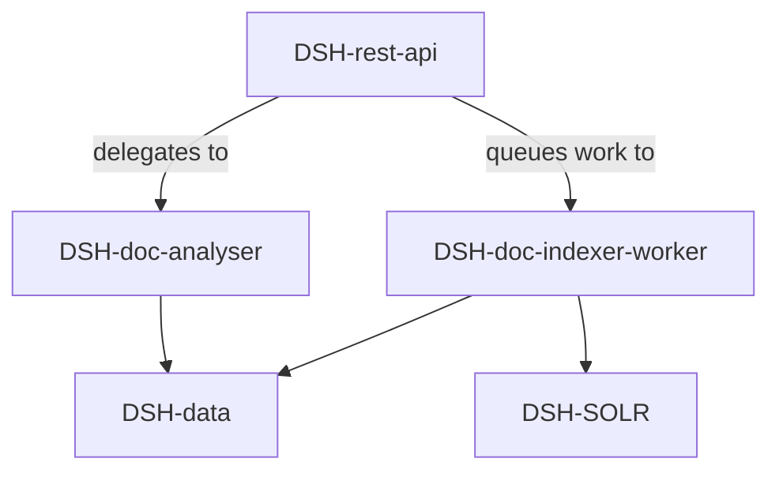

# Component Diagrams

This directory contains component-level architecture diagrams for the DSH system.

## Contents

| File | Description |
|------|-------------|
| *(to be added)* | Markdown or image files depicting component relationships |

## Guidelines

- Prefer text-based diagrams (Mermaid, PlantUML, ASCII) so they can be version-controlled and reviewed in PRs
- Name files descriptively: `analyzer-component.md`, `api-component.md`, etc.
- Reference diagrams from the relevant feature spec in `../../features/`

## Example Mermaid Diagram

