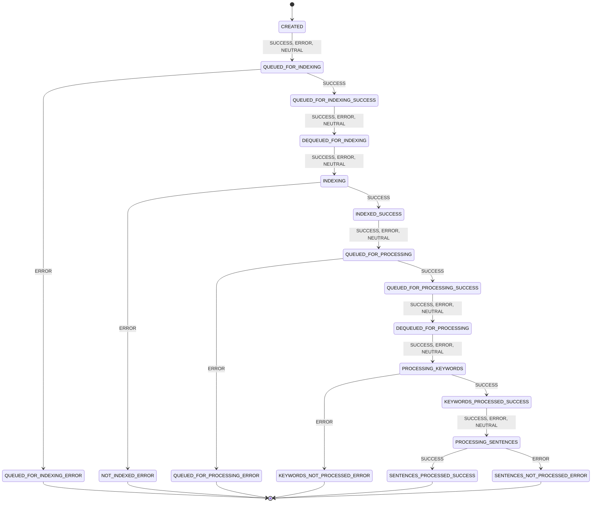

# Document Status Workflow

The statuses a document moves through in DSH, and the transitions between them. Each edge is
labelled with the `TransitionType` values that cause it. `[*]` marks where a document enters and
the statuses it never leaves.

This diagram is generated from `DocumentStatus` in `dsh-data`, not drawn.
`DocumentStatusDiagramTest` regenerates it on every build and fails when this file disagrees.
To update it, run `mvn -B -pl dsh-data test -Dtest=DocumentStatusDiagramTest`, and copy the block
from the failure message over the one below. Keep exactly one `mermaid` block in this file. The
test compares only that block, so the text around it can change freely.

