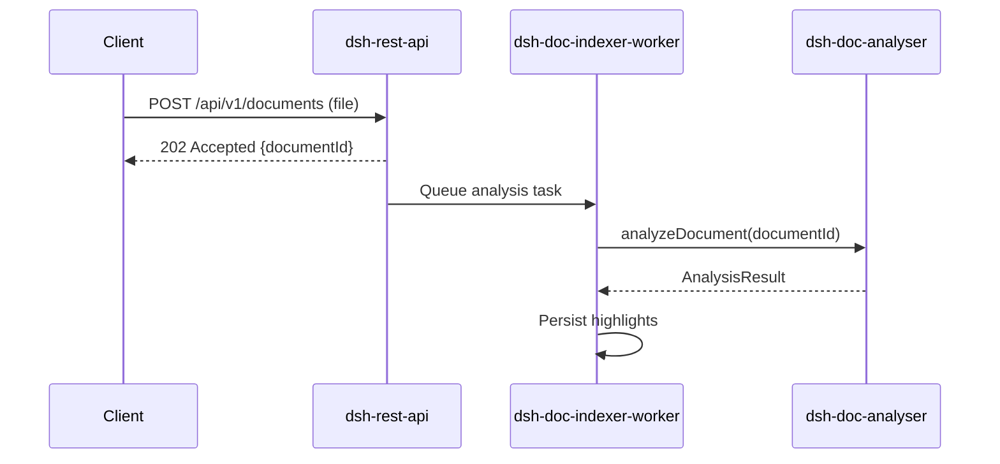

# Sequence Diagrams

This directory contains sequence diagrams illustrating the process flows in the DSH system.

## Contents

| File | Description |
|------|-------------|
| *(to be added)* | Sequence diagrams for key DSH workflows |

## Suggested Diagrams to Add

- `document-upload-flow.md` – Document upload and analysis trigger
- `async-indexing-flow.md` – Background indexing worker lifecycle
- `highlight-retrieval-flow.md` – Client retrieves highlights for a document

## Guidelines

- Use Mermaid `sequenceDiagram` syntax for text-based diagrams
- Show all participating components (client, REST API, analyser, worker, databases)
- Annotate asynchronous steps clearly
- Reference the relevant feature spec in each diagram file

## Example

